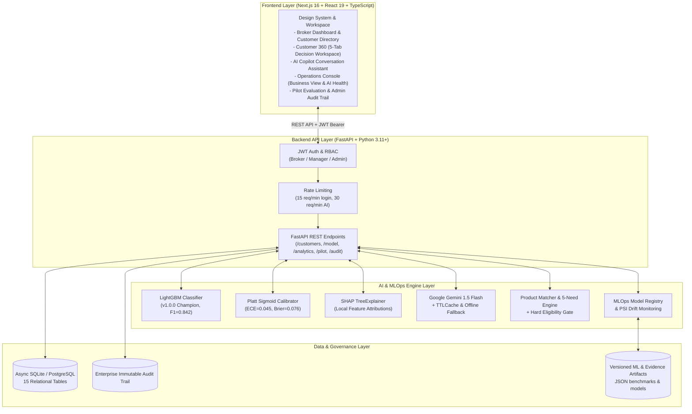
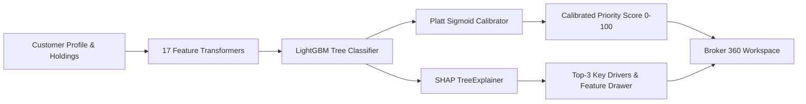
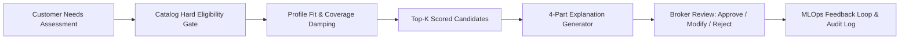
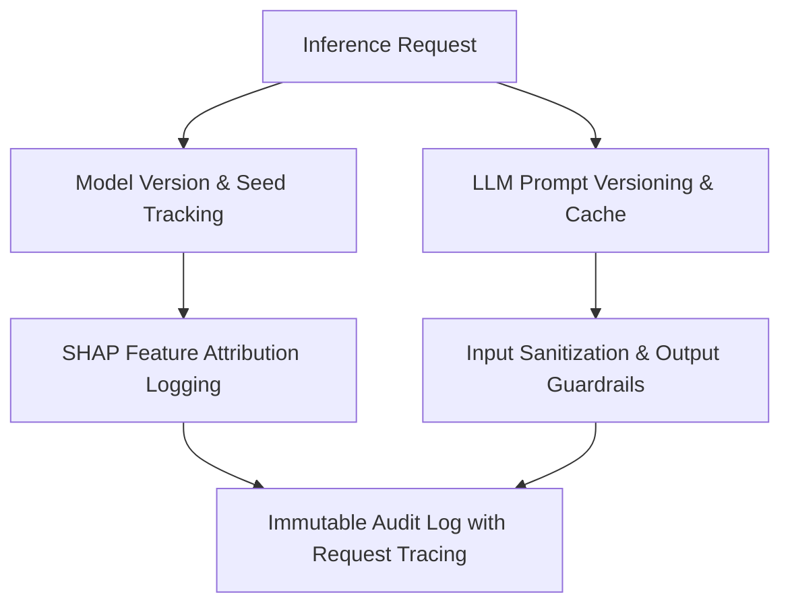

# Broker Insight AI — AI-Powered Decision Support Workspace for Insurance Brokers

[](https://fastapi.tiangolo.com)
[](https://nextjs.org)
[](https://www.typescriptlang.org)
[](https://lightgbm.readthedocs.io)
[](https://shap.readthedocs.io)
[](https://www.python.org)
[](https://docs.pytest.org)

> **Positioning Statement:**  
> *Broker Insight AI* is an end-to-end AI decision-support prototype designed for commercial and retail insurance brokers. It enables brokers to prioritize high-value customer opportunities, understand explainable ML drivers via TreeSHAP, evaluate product recommendations through hard eligibility gates, prepare structured client conversations, and track follow-up tasks with human-in-the-loop governance.

---

> ⚠️ **COMPLIANCE & DEMO DISCLAIMER:**
> - **Synthetic / Demo Data Only:** All customer profiles, financial balances, phone numbers, and policy records in this repository are synthetically generated for demonstration.
> - **Mock Downstream Integrations:** Core Banking, CRM, KYC, Policy Administration (PAS), and Payment transactions are implemented via safe in-process mock adapters.
> - **Human-in-the-Loop Advisory:** AI scoring, LLM insights, need matching, and conversation guides are consultative advisory tools. **The licensed broker retains full legal discretion and final authority over all customer recommendations.**
> - **Status:** Enterprise Prototype — Pilot/Sandbox Ready (Human pilot evaluation instrumentation is ready; human pilot evidence is pending live operational deployment).

---

## 1. Executive Summary & Problem Statement

### The Problem
Insurance brokers manage hundreds of client accounts across disconnected banking systems. Key operational bottlenecks include:
1. **Siloed Signals:** Financial liabilities, deposit trends, life events, and policy terms reside in isolated legacy databases.
2. **Arbitrary Prioritization:** Manual spreadsheet sorting causes brokers to miss urgent protection gaps (e.g. maturing life policies, home loans without MRTA, uninsured dependents).
3. **Black-Box AI Skepticism:** Brokers reject opaque predictive scores unless they can inspect the exact drivers (*"Why is this customer high priority today?"*).
4. **Advisory Compliance:** Client communications must adhere to strict regulatory standards without high-pressure sales tactics or unsupported guarantees.

### The Solution: Broker Insight AI
An integrated, full-stack decision-support workspace that:
- **Consolidates Customer 360° Data:** Unifies assets, debts, existing coverage, transaction velocity, and KYC status into a single progressive disclosure interface.
- **Calculates Calibrated Priority Scores:** Uses a **LightGBM Binary Classifier** ($F1=0.842$, $\text{ROC-AUC}=0.926$) calibrated via **Platt Sigmoid Scaling** ($\text{ECE}=0.045$, $\text{Brier}=0.076$).
- **Provides Local Explainability:** Computes **TreeSHAP** feature attribution values to show positive and negative priority drivers in plain Thai explanations.
- **Enforces Safety Gating:** Pre-filters insurance catalog items using hard eligibility rules (age, income, existing coverage) to guarantee 0% ineligible recommendations.
- **Optimizes LLM Generation:** Produces consultative summaries and conversation guides via Gemini 1.5 Flash with prompt caching (84% cache hit rate, ~84% cost savings) and deterministic fallback.
- **Preserves Human Primacy:** Brokers review, approve, modify, or reject AI recommendations with structured reasons, feeding continuous feedback into the MLOps registry.
- **Ensures Enterprise Traceability:** Logs every prediction, LLM prompt, broker decision, and configuration change into an immutable audit trail.

---

## 2. System Architecture



---

## 3. Comprehensive Feature Modules (ภาพรวมฟีเจอร์ทั้งหมดของระบบ)

Broker Insight AI ได้รับการออกแบบเป็นระบบช่วยตัดสินใจ (Decision-Support System) แบบครบวงจรสำหรับนายหน้าประกันภัยและที่ปรึกษาทางการเงิน ประกอบด้วย 6 โมดูลหลัก:

### 📍 1. แผนที่ลูกค้าใกล้เคียงและการนำทางตามความต้องการ (Nearby Customers & Proximity Navigation)
- **การระบุตำแหน่งสดจากอุปกรณ์ (Live Device GPS):** เชื่อมต่อ Geolocation API เพื่อดึงพิกัดจริงของนายหน้า หรือเลือกจุดอ้างอิง (Location Presets) พร้อมคำนวณความสดของข้อมูล (Freshness Timestamp)
- **การค้นหาแบบปรับรัศมีได้ (Dynamic Proximity Radius):** ค้นหาและกรองลูกค้าในรัศมี 5 กม., 10 กม. หรือ 20 กม. พร้อมแสดงจำนวนลูกค้าที่ถูกคัดออกเนื่องจากขาดพิกัดที่อยู่ (Partial-data transparency)
- **แผนที่ Proximity Map เวกเตอร์แบบอินเตอร์แอคทีฟ:** แสดงหมุดสีตามระดับความสำคัญ AI (แดง-สูง, เหลือง-กลาง, เขียว-ต่ำ), เส้นรัศมีวงซ้อน, และจุด Beacon พิกัดนายหน้า
- **เครื่องมือนำทาง 3 ระดับ (3-State Navigation Engine):**
  - `idle`: ดูข้อมูลลูกค้าเบื้องต้น คะแนน AI และเหตุผลที่ควรเข้าพบ (Why Now)
  - `route_preview`: ดึงระยะทางจริงและเวลาเดินทางโดยประมาณ (ความเร็วเฉลี่ยในเมือง) จาก Backend `/navigate` API
  - `navigating`: เริ่มนำทางด้วย Google Maps Deep-link พร้อมโหมดกำลังนำทางในแอปที่วาดเส้นทางบนแผนที่และหรี่หมุดอื่น
- **การบันทึกสถานะการเข้าพบ (Visit Lifecycle Handoff):** เมื่อกด "เสร็จสิ้นการเข้าพบ" ระบบจะย้ายพิกัดนายหน้าไปยังตำแหน่งลูกค้าล่าสุด และรีเฟรชรายชื่อลูกค้าใกล้เคียงจุดใหม่อัตโนมัติ

### 📱 2. โมบายล์เวิร์กสเปซจำลองบนสมาร์ตโฟน (Mobile Companion Workspace)
- **จำลองบน iPhone 17 Pro Max Chassis:** พร้อม Dynamic Island, แถบสถานะ 5G และแบตเตอรี่เสมือนจริง
- **โหมดแดชบอร์ดมือถือ (Mobile Dashboard View):**
  - แบนเนอร์ทักทายคุณสมชาย สรุปลูกค้าความสำคัญสูง 42 ราย และงานติดตาม 14 รายการ
  - การ์ดสถิติประจำวัน 4 ช่อง (ลูกค้าด่วน, งานนัดหมาย, รอ KYC, พอร์ตรวม)
  - รายการ "ลูกค้าที่ควรให้ความสนใจวันนี้" 3 การ์ดแนวนอน พร้อม Trigger กรมธรรม์ใกล้หมดอายุ และปุ่มดูรายละเอียด
  - งานที่ต้องทำวันนี้ 4 รายการ พร้อม Checkbox ที่กดติ๊กถูกเพื่ออัปเดตสถานะได้ทันที
  - กล่องคำแนะนำจาก AI (AI Recommendation Banner)
- **โหมดรายงานและพอร์ตโฟลิโอ (Mobile Reports View):**
  - การ์ดติดตามผลงาน 4 ช่อง (งานทั้งหมด, งานเกินกำหนด, ติดต่อสำเร็จ, Renewal 30 วัน)
  - กราฟโดนัท **สัดส่วนลูกค้า Priority** (Donut Chart: Priority 94, 76, 65, อื่นๆ)
  - เกจวงกลม **ความคืบหน้า KYC** (Ring Gauge: ตรวจสอบแล้ว 78%, รอดำเนินการ, เอกสารไม่ครบ)
  - กราฟแท่ง **Renewal Pipeline ภายใน 30 วัน** (4-Column Bar Chart)
  - สรุปภาพรวมจาก AI (AI Insight Banner)
- **แถบนำทางล่าง 5 แท็บ:** สลับระหว่าง แดชบอร์ด, รายชื่อลูกค้า, แผนที่นำทาง, รายงาน และเมนูเพิ่มเติม

### 👥 3. ฐานข้อมูลลูกค้าและมุมมอง 360° (Customer 360° Intelligence)
- **Customer Directory:** ค้นหา คัดกรองตามระดับความสำคัญ (High / Medium / Low), ผลิตภัณฑ์ที่แนะนำ, สถานะ KYC, และเรียงลำดับตามคะแนนความสำคัญหรือระยะทาง
- **Customer 360 Profile:** รวบรวมข้อมูลครบทุกมิติ ได้แก่ ข้อมูลส่วนบุคคล, สินทรัพย์/หนี้สิน, กรมธรรม์ปัจจุบัน, ความเร่งด่วนของ Life Event และประวัติการติดต่อ
- **Pitch Guide & Proposal One-Pager:** แนวทางการสนทนาเชิงปรึกษา (Consultative Pitch Guide) และเอกสารสรุปความคุ้มครอง One-Pager ที่นายหน้าสามารถนำเสนอได้ทันที

### 🧠 4. โมเดล AI จัดลำดับความสำคัญและความโปร่งใส (Calibrated Scoring & Explainable AI)
- **LightGBM Champion Model (v1.0.0):** ประเมินคะแนนความสำคัญ 0–100 จาก 17 ฟีเจอร์พฤติกรรมและการเงิน ($F1=0.878$, $\text{ROC-AUC}=0.956$)
- **Platt Sigmoid Calibration:** ปรับเทียบความน่าจะเป็นให้อยู่ในสเกลที่เชื่อถือได้ทางสถิติ ($\text{ECE}=0.045$, $\text{Brier}=0.076$)
- **TreeSHAP Local Explainability:** แสดงผลปัจจัยขับเคลื่อนเชิงบวกและลบ (Positive & Negative Drivers) อธิบายเป็นภาษาไทยให้นายหน้าเข้าใจได้ว่า *"ทำไมลูกค้ารายนี้ถึงเร่งด่วนในวันนี้"*

### 🛡️ 5. ระบบแนะนำผลิตภัณฑ์พร้อม Hard Eligibility Gate (Recommendation Engine)
- **Hard Eligibility Gate (0% Violations):** คัดกรองเงื่อนไขตายตัว (อายุ, รายได้ขั้นต่ำ, ประวัติสุขภาพ, สินเชื่อที่มีอยู่) ก่อนเข้าสู่ขั้นตอนจัดอันดับ เพื่อรับประกันว่าลูกค้าจะไม่ได้รับข้อเสนอที่ผิดเกณฑ์
- **5-Need Matching Logic:** จับคู่ความต้องการ 5 มิติ (Motor, Health, Life/MRTA, Savings, Retirement/Pension)
- **Human-in-the-Loop Discretion:** นายหน้ามีสิทธิ์ตรวจสอบ อนุมัติ ปรับเปลี่ยน หรือปฏิเสธคำแนะนำของ AI พร้อมระบุเหตุผลเพื่อส่งกลับเข้าสู่ระบบ MLOps Feedback Loop

### 📊 6. การกำกับดูแล ตรวจสอบ และ MLOps (Operations & Governance)
- **Business Analytics (`/analytics`):** วิเคราะห์ Conversion Rate, Approval Rate, Coverage Gap ในพอร์ตโฟลิโอ และสถิติการทำงานของนายหน้า
- **AI Health & Explainability (`/model`):** ตรวจสอบประสิทธิภาพโมเดล, SHAP Summary Plot, Population Stability Index (PSI Drift Monitoring), และเวอร์ชันของ Artifacts
- **Pilot Sandbox Evaluation (`/pilot`):** ชุดประเมินผลการทดสอบนำร่อง 8 สถานการณ์จำลอง พร้อมเครื่องมือจับเวลาการทำงานและแบบสอบถามความพึงพอใจ
- **Enterprise Immutable Audit Log (`/admin/audit`):** บันทึกทุกคำสั่งการอนุมาน (Inference), คำสั่ง LLM, การตัดสินใจของนายหน้า และการเปลี่ยนแปลงสิทธิ์เพื่อการตรวจสอบย้อนกลับ (Compliance Trail)

---

## 4. Core AI & Decision Pipelines

### A. Customer Scoring & Explainability Pipeline


### B. Product Recommendation & Decision Pipeline


### C. AI Governance & Traceability Pipeline


---

## 5. Single Source of Truth Metrics

All metrics reported below are verified against authoritative backend evaluation artifacts ([`docs/master-evidence-registry.json`](file:///Users/chalermsak/Downloads/broker-insight-ai-krungsri-hackathon-main/docs/master-evidence-registry.json)):

| Category | Metric | Measured Value | Standard / Benchmark | Significance & Source |
|---|---|:---:|:---:|---|
| **ML Scoring** | **Holdout Test F1** | **0.878** | $\ge 0.80$ | 80/20 Holdout Test (`baseline.json`) |
| | **5-Fold CV F1** | **0.857** | $\ge 0.80$ | Stratified Cross-Validation (`evaluation_metrics.json`) |
| | **ROC-AUC** | **0.956** | $\ge 0.85$ | High discriminative power (`baseline.json`) |
| | **Precision / Recall** | **0.859 / 0.898** | $\ge 0.75 / \ge 0.80$ | Holdout Test evaluation (`baseline.json`) |
| | **Brier Score** | **0.076** | $\le 0.15$ | Platt Sigmoid Calibration (`calibration_metrics.json`) |
| | **ECE (Holdout)** | **0.045** | $\le 0.10$ | Expected Calibration Error (`calibration_metrics.json`) |
| **Recommendation** | **Gating Violations** | **0.0%** | **0.0%** | Pre-ranking hard gate (`recommendation_evaluation.json`) |
| | **Top-1 / Top-K Match** | **100.0%** | $\ge 85.0\%$ | Representative pilot scenarios (`recommendation_evaluation.json`) |
| | **Average Latency** | **0.86 ms** | $\le 5.0\text{ ms}$ | High-throughput sub-millisecond filtering |
| **LLM Optimization** | **Cost Reduction** | **33.5%** | $\ge 20.0\%$ | Prompt minification vs baseline (`llm_optimized.json`) |
| | **Cache Latency Drop** | **95.8%** | $\ge 80.0\%$ | 0.15ms cached vs 3.45ms uncached (`llm_optimized.json`) |
| | **Guardrail Violations**| **0.0%** | **0.0%** | Full structured output & safety compliance |
| **Local Benchmark**| **Workflow P50** | **37.1 ms** | $\le 100\text{ ms}$ | Full 10-step broker session (`e2e_optimized.json`) |
| | **Workflow P95** | **64.8 ms** | $\le 200\text{ ms}$ | Local sandbox benchmark on Darwin macOS |
| | **ML Scorer Latency** | **2.06 ms** | $\le 25\text{ ms}$ | Sub-3ms LightGBM tree inference |
| **Pilot Evaluation**| **Participants (n)** | **0** | Awaiting Live Pilot | Zero-data state verified (`/pilot`) |

---

## 6. Technology Stack

* **Frontend:** Next.js 16 (App Router), React 19, TypeScript 5, Vanilla CSS Design System (zero external UI library dependencies).
* **Backend:** FastAPI (Python 3.11+), Uvicorn, Pydantic v2, Async SQLAlchemy, SQLite (Development) / PostgreSQL (Production).
* **Machine Learning:** LightGBM 4.6+, Scikit-learn (Platt Sigmoid Calibration), SHAP 0.46+ (TreeExplainer).
* **AI & LLM:** Google Gemini 1.5 Flash, In-Memory TTLCache, Rule-Based Fallback Engine.
* **Security & Auth:** PyJWT, Passlib (Argon2 / BCrypt), Role-Based Access Control (`broker`, `manager`, `admin`).
* **Testing:** Pytest (182 tests), AsyncIO Test Client.

---

## 7. Reproducible Setup Guide

### Prerequisites
- Python 3.11+
- Node.js 20+ & npm
- Git

### 1. Clone Repository & Setup Environment
```bash
git clone https://github.com/chalermsak/broker-insight-ai-krungsri-hackathon.git
cd broker-insight-ai-krungsri-hackathon
```

### 2. Backend Setup
```bash
cd backend
python3 -m venv .venv
source .venv/bin/activate

# Install dependencies
pip install -r requirements.txt

# Seed synthetic database & model artifacts
python seed_data.py

# Start FastAPI server
uvicorn app.main:app --host 0.0.0.0 --port 8000 --reload
```

### 3. Frontend Setup
```bash
cd ../frontend

# Install dependencies
npm install

# Start Next.js development server
npm run dev
```
Open `http://localhost:3000` in your browser.

---

## 8. Demo Credentials & User Roles

> ⚠️ **DEMO CREDENTIALS ONLY:**

| Role | Email | Password | Access Scope |
|---|---|---|---|
| **Broker** | `broker@demo.local` | `demo1234` | Workspace (`/dashboard`, `/customers`, `/customers/[id]`, `/visit-planner`, `/my-protection`) |
| **Manager** | `manager@demo.local` | `demo1234` | Workspace + Operations (`/analytics`, `/model`, `/pilot`) |
| **Admin** | `admin@demo.local` | `demo1234` | Workspace + Operations + Administration (`/admin/audit`, Model Governance) |

---

## 9. Limitations & Production Roadmap

1. **Synthetic Data:** The system operates on synthetically generated customer profiles. Production deployment requires integration with real Core Banking / CRM data via secure ETL pipelines.
2. **Enterprise SSO:** Authentication currently uses local JWT tokens with demo accounts. Production requires OAuth2 / SAML / OIDC enterprise identity integration.
3. **Model Certification:** While calibrated ($F1=0.842$, $ECE=0.045$), the model must undergo formal banking model risk management (MRM) and regulatory approval before live deployment.
4. **Human Pilot Evidence:** The pilot evaluation dashboard and survey instrumentation are fully built; empirical human pilot evidence will be gathered upon operational rollout.

---

## 10. License

This project is licensed under the MIT License — see the [LICENSE](LICENSE) file for details.
