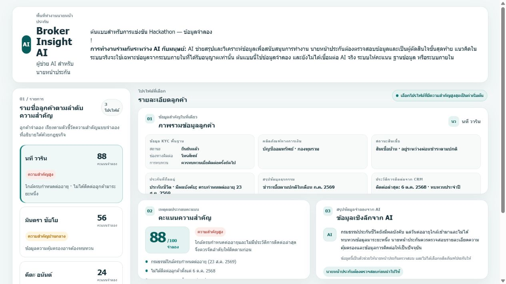
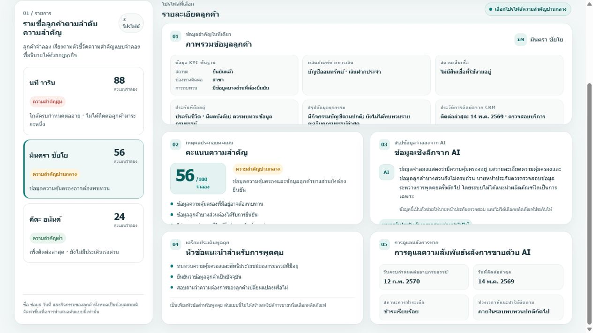

# Broker Insight AI

**Safe portfolio label:** Broker Insight AI - Krungsri Hackathon Prototype

Broker Insight AI is a single-file web prototype for an insurance-broker workflow. It explores how a broker could review a simulated customer priority list, inspect customer information, read explainable signals, and prepare a follow-up conversation.

## Krungsri Hackathon context

The official project name is **Broker Insight AI**. This repository contains a demonstration prototype only; it is not a Krungsri production system.

## Problem

Insurance brokers may need to review customer information, identify which relationships need attention, and prepare an appropriate conversation. The prototype explores how a prioritised view and explainable summaries could support that review.

## Proposed solution

The interface combines simulated business-rule signals with simulated AI-style summaries. The broker remains responsible for checking the information and making the final decision.

## Target user and main workflow

The prototype is designed around an insurance-broker user. The production user roles are not confirmed beyond the current interface.

1. Review the simulated customer priority list.
2. Select a customer profile.
3. Check the simulated KYC, financial-product, loan, insurance, transaction, and contact fields.
4. Review the simulated importance score and its explanation.
5. Read the simulated insight and suggested conversation topics.
6. Review the simulated after-sales follow-up information.

## Key prototype features

- Customer priority list based on simulated business rules
- Customer profile overview with simulated KYC and relationship information
- Simulated importance score with an explanation
- Simulated AI-style insight summary
- Suggested conversation topics
- Simulated after-sales relationship follow-up

## Screenshots

## Prototype versus production

This is a client-side static prototype. It is not connected to real AI, a database, a Krungsri internal system, or a production insurance system. It does not select an insurance product or create a sales script.

All customer records, KYC fields, financial details, CRM information, scores, insights, and follow-up values are simulated. The score is not a certified prediction and does not represent a proven accuracy result.

## How to open

Open `index.html` in a modern web browser. No build step, package manager, server, or external dependency is required.

## Demo

Live public demo is not enabled while the Hackathon repository remains private.

## 60-second judging walkthrough

1. Open `index.html`.
2. Start with the priority list on the left.
3. Select a different customer profile.
4. Point out the simulated score, explanation, insight, conversation topics, and follow-up information.
5. Explain that the screen demonstrates decision support only and contains fictional data.

## Current limitations

- No real AI service, database, authentication, or internal-system connection
- No production user-role validation
- No certified scoring or model-accuracy result
- No product recommendation or automated sales-script generation
- No public live demo while the Hackathon repository remains Private

## Future development

Future work would require verified competition requirements, approved data governance, validated user roles, and an explicit production integration plan. Those items are outside the scope of this static prototype.

## License and reuse

License and reuse permissions have not yet been published. All rights remain with the project contributors unless otherwise stated.
