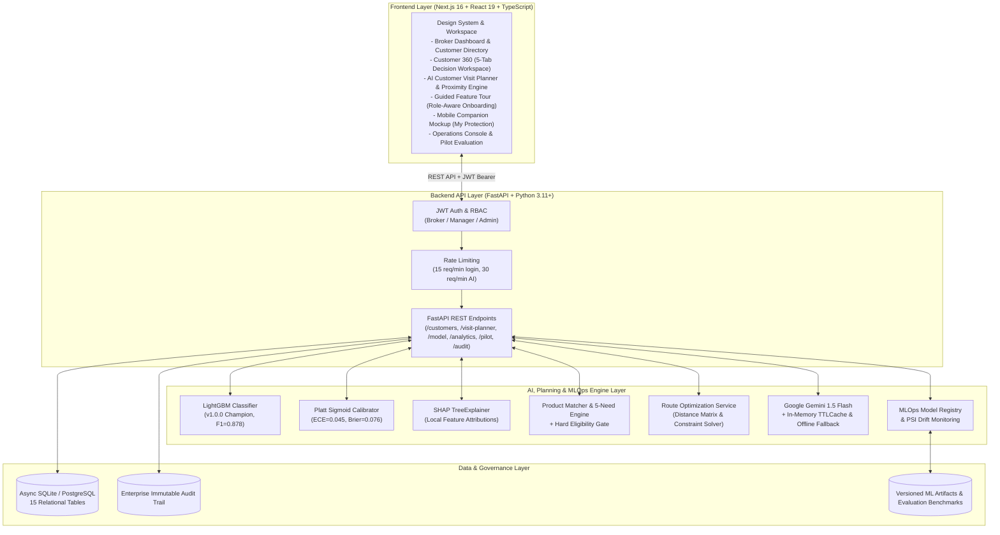

# Broker Insight AI — AI-Powered Decision Support Workspace for Insurance Brokers

[](https://fastapi.tiangolo.com)
[](https://nextjs.org)
[](https://www.typescriptlang.org)
[](https://lightgbm.readthedocs.io)
[](https://shap.readthedocs.io)
[](https://www.python.org)
[](https://docs.pytest.org)
[](https://nodejs.org/api/test.html)

> **Positioning Statement:**  
> *Broker Insight AI* is an end-to-end AI decision-support workspace tailored for commercial and retail insurance brokers. It empowers brokers to prioritize high-value customer opportunities, understand explainable ML drivers via TreeSHAP, evaluate insurance products through hard eligibility gating, plan intelligent multi-stop client visits, navigate on-demand, and prepare consultative conversations — all while strictly maintaining human-in-the-loop governance.

---

> ⚠️ **COMPLIANCE & DEMO DISCLAIMER:**
> - **Synthetic / Demo Data Only:** All customer profiles, financial balances, phone numbers, and policy records in this repository are synthetically generated for demonstration.
> - **Mock Downstream Integrations:** Core Banking, CRM, KYC, Policy Administration (PAS), and Payment transactions are implemented via safe in-process mock adapters.
> - **Human-in-the-Loop Advisory:** AI scoring, LLM insights, need matching, and route suggestions are consultative advisory tools. **The licensed broker retains full legal discretion and final authority over all customer recommendations and visits.**
> - **Status:** Enterprise Prototype — Pilot/Sandbox Ready (Comprehensive instrumentation ready; pending live operational deployment).

---

## 1. Executive Summary & Core Value Proposition

### 🚩 The Operational Challenges
Insurance brokers manage hundreds of client relationships across disconnected banking and legacy insurance systems:
1. **Siloed Customer Signals:** Financial liabilities, deposit trends, life events, and policy expiration dates reside in separate databases.
2. **Arbitrary Prioritization:** Spreadsheets and manual sorting cause brokers to miss critical protection gaps (e.g. maturing life policies, home loans without MRTA, new dependents without health coverage).
3. **Black-Box Skepticism:** Brokers reject opaque predictive scores unless they can inspect the exact underlying drivers (*"Why is this customer high priority today?"*).
4. **Inefficient Field Travel:** Brokers spend hours manually planning daily client visit routes without consideration of priority, traffic, or schedule feasibility.
5. **Regulatory & Advisory Compliance:** Communications must adhere to strict regulatory standards without high-pressure sales tactics or unsupported product suitability.

### 💡 The Solution: Broker Insight AI
An integrated, full-stack decision-support workspace that:
- **Unifies Customer 360° Data:** Centralizes assets, debts, existing coverage, transaction velocity, and KYC status into a single progressive-disclosure interface.
- **Calculates Calibrated Priority Scores:** Uses a **LightGBM Binary Classifier** ($F1=0.878$, $\text{ROC-AUC}=0.956$) calibrated via **Platt Sigmoid Scaling** ($\text{ECE}=0.045$, $\text{Brier}=0.076$).
- **Provides Local Explainability:** Computes **TreeSHAP** feature attributions to display positive and negative priority drivers in clear Thai explanations.
- **Enforces Hard Eligibility Gating:** Pre-filters insurance catalog items with hard business constraints (age, income, existing coverage) to guarantee 0% ineligible recommendations.
- **Optimizes Field Visits (AI Visit Planner):** Recommends feasible multi-stop itineraries based on priority scores, proximity radius (5/10/20 km), working hours, and traffic time.
- **Guides First-Time Users:** Delivers an interactive, role-aware guided onboarding tour (9 steps for Broker, 5 for Manager, 5 for Admin).
- **Standardizes Thai Typography:** Features an enterprise two-tier typography system with a strict 12px minimum font size and collision-free Thai diacritic line heights.
- **Preserves Human Primacy:** Brokers review, approve, modify, or reject AI recommendations with structured reasons, feeding continuous feedback into the MLOps registry.

---

## 2. System Architecture



---

## 3. Comprehensive Feature Modules (ภาพรวมฟีเจอร์ทั้งหมดของระบบ)

Broker Insight AI ได้รับการออกแบบเป็นระบบช่วยตัดสินใจ (Decision-Support System) แบบครบวงจรสำหรับนายหน้าประกันภัยและที่ปรึกษาทางการเงิน ประกอบด้วย 8 โมดูลหลัก:

### 🗺️ 1. ระบบวางแผนการเข้าพบลูกค้าอัจฉริยะ (AI Customer Visit Planner & Route Optimization)
- **การคัดเลือกลูกค้าตามความคุ้มค่า (Intelligent Candidate Selection):** ดึงรายชื่อลูกค้าที่ควรเข้าพบโดยคำนวณจากคะแนนความสำคัญ AI, สถานะ KYC, และช่องว่างความคุ้มครอง
- **การค้นหาและกรองตามรัศมี (Proximity Radius Filter):** กรองลูกค้าในรัศมี 5 กม., 10 กม. หรือ 20 กม. จากพิกัดปัจจุบัน พร้อมระบบแจ้งเตือนความโปร่งใสกรณีลูกค้ายังไม่มีพิกัด GPS (Partial-Data Transparency)
- **การจำลองเส้นทางและคำนวณข้อจำกัด (Constraint-Aware Optimization):**
  - กำหนดเวลาเริ่ม-สิ้นสุดการทำงาน และเวลาพักรับประทานอาหารกลางวัน
  - ตรวจสอบความเป็นไปได้ของเส้นทาง (เวลาเดินทางรวม, ระยะทางรวม, ระยะเวลาเข้าพบ 45 นาที/ราย)
  - ให้คะแนนความเป็นไปได้ของตารางงาน (Schedule Feasibility Score 0–100%)
- **การนำทางแบบ On-Demand (Point-to-Point Navigation):** สร้าง Google Maps Deep-link สำหรับนำทางทีละจุด โดยนายหน้าเป็นผู้กดเริ่มนำทางเองเสมอ (ไม่มีการสั่งการอัตโนมัติ)
- **วงจรการอัปเดตสถานะ (Visit Lifecycle):** เมื่อเข้าพบเสร็จสิ้น ระบบจะย้ายหมุดตำแหน่งนายหน้ามายังจุดล่าสุด และคำนวณหารายชื่อลูกค้าใกล้เคียงรอบจุดใหม่ทันที

### 🌟 2. ระบบแนะนำการใช้งานสำหรับผู้ใช้ใหม่ (First-Time User Onboarding & Guided Tour)
- **หน้าต่างต้อนรับอัตโนมัติ (Onboarding Welcome Modal):** แสดงข้อความต้อนรับและไฮไลต์คุณค่าของระบบเมื่อเข้าสู่ระบบครั้งแรก
- **ทัวร์แนะนำระบบตามบทบาทผู้ใช้ (Role-Aware Guided Tour):**
  - **👔 สำหรับนายหน้า (Broker Tour — 9 ขั้นตอน):** แดชบอร์ดภาพรวม ➔ จัดการและค้นหาลูกค้า ➔ รู้จักลูกค้าในมุมมอง 360° ➔ AI ช่วยวิเคราะห์ลูกค้า ➔ คำแนะนำผลิตภัณฑ์ที่เหมาะสม ➔ ค้นหาลูกค้าใกล้เคียง ➔ นายหน้าเป็นผู้เลือกเข้าพบ ➔ นำทางเมื่อพร้อม ➔ ดูผลการดำเนินงาน
  - **📈 สำหรับผู้จัดการ (Manager Tour — 5 ขั้นตอน):** ภาพรวมการดำเนินงาน ➔ การวิเคราะห์ลูกค้า ➔ ความเสี่ยงและ Coverage Gap ➔ AI Insight & ประสิทธิภาพทีม ➔ การกำกับดูแลและรายงาน
  - **🛡️ สำหรับผู้ดูแลระบบ (Admin Tour — 5 ขั้นตอน):** แดชบอร์ดศูนย์กลาง ➔ ตรวจสอบสุขภาพโมเดล AI ➔ ความโปร่งใส SHAP ➔ บันทึกประวัติการตรวจสอบย้อนกลับ ➔ การจำลองสถานการณ์นำร่อง
- **สปอตไลต์อินเตอร์แอคทีฟ (Interactive Spotlight):** ปรับความมืดพื้นหลังและเน้นไฮไลต์สีทองรอบปุ่มเป้าหมาย พร้อมรองรับคีย์บอร์ด (`Esc`, ลูกศรซ้าย/ขวา)
- **เปิดดูซ้ำได้ตลอดเวลา (Replay on Demand):** มีปุ่มช่วยเหลือ `?` ที่แถบด้านบน (Topbar) และในเมนูโปรไฟล์

### 🔤 3. ระบบตัวอักษรภาษาไทยระดับองค์กร (Global Thai Typography System)
- **ระบบฟอนต์ 2 ระดับ (Two-Tier Hierarchy):**
  - **UI Sans-Serif ("ไม่มีหัว"):** `Prompt`, `Noto Sans Thai`, `Inter` สำหรับการกวาดสายตาอย่างรวดเร็ว บนแถบนำทาง, ปุ่มกด, ป้ายสถานะ/Priority, ตัวเลข KPI, ตารางข้อมูล และฟอร์ม
  - **Reading Serif / Looped ("มีหัว"):** `Noto Serif Thai`, `Sarabun` สำหรับการอ่านเนื้อหายาว, สรุปบทวิเคราะห์จาก AI, เหตุผลความเร่งด่วน (Why Now), บทสนทนาเตรียมพบลูกค้า และคำอธิบายผลิตภัณฑ์
- **ขนาดตัวอักษรขั้นต่ำ 12px ทั่วทั้งระบบ:** ไม่มีข้อความ UI ปกติใดเล็กกว่า 12px (กำจัดขนาด 8–11px ทั้งหมด)
- **ระยะห่างบรรทัดป้องกันวรรณยุกต์ซ้อน (Diacritic Collision-Free):** กำหนดความสูงบรรทัดที่เหมาะสม (`1.35` หัวข้อ, `1.45` UI, `1.65` ข้อความทั่วไป, `1.8` บทความ AI) ทำให้อ่านสระบน-ล่างและวรรณยุกต์ไทยได้อย่างชัดเจน

### 📱 4. โมบายล์เวิร์กสเปซจำลองบนสมาร์ตโฟน (Mobile Companion Workspace — My Protection)
- **จำลองบน iPhone Chassis:** พร้อม Dynamic Island และแถบสถานะเสมือนจริง
- **โหมดแดชบอร์ดมือถือ:** แบนเนอร์ทักทาย, การ์ด 4 สถิติด่วน, ลูกค้าที่ควรให้ความสนใจ 3 รายการ, งานที่ต้องทำประจำวันพร้อม Checkbox, และคำแนะนำสรุปจาก AI
- **โหมดรายงานและพอร์ตโฟลิโอ:** Donut Chart สัดส่วนลูกค้า Priority, Ring Gauge ความคืบหน้า KYC, 4-Column Bar Chart รายการ Renewal ภายใน 30 วัน

### 👥 5. ฐานข้อมูลลูกค้าและมุมมอง 360° (Customer 360° Intelligence)
- **Customer Directory:** ค้นหา คัดกรองตามระดับความสำคัญ (High / Medium / Low), ผลิตภัณฑ์แนะนำ, สถานะ KYC, และเรียงตามคะแนนหรือระยะทาง
- **Customer 360 Profile:** รวบรวมข้อมูลครบ 5 มิติ ได้แก่ ข้อมูลส่วนบุคคล, สินทรัพย์/หนี้สิน, กรมธรรม์ปัจจุบัน, ความเร่งด่วนของ Life Event และประวัติการติดต่อ
- **Pitch Guide & Proposal One-Pager:** แนวทางการสนทนาเชิงปรึกษา และเอกสารสรุปความคุ้มครอง One-Pager ที่นำเสนอได้ทันที

### 🧠 6. โมเดล AI จัดลำดับความสำคัญและความโปร่งใส (Calibrated Scoring & Explainable AI)
- **LightGBM Champion Model (v1.0.0):** ประเมินคะแนนความสำคัญ 0–100 จาก 17 ฟีเจอร์ ($F1=0.878$, $\text{ROC-AUC}=0.956$)
- **Platt Sigmoid Calibration:** ปรับเทียบความน่าจะเป็นให้อยู่ในสเกลที่เชื่อถือได้ทางสถิติ ($\text{ECE}=0.045$, $\text{Brier}=0.076$)
- **TreeSHAP Local Explainability:** แสดงผลปัจจัยขับเคลื่อนเชิงบวกและลบ อธิบายเป็นภาษาไทยให้นายหน้าเข้าใจว่า *"ทำไมลูกค้ารายนี้ถึงเร่งด่วนในวันนี้"*

### 🛡️ 7. ระบบแนะนำผลิตภัณฑ์พร้อม Hard Eligibility Gate (Recommendation Engine)
- **Hard Eligibility Gate (0% Violations):** คัดกรองเงื่อนไขตายตัว (อายุ, รายได้ขั้นต่ำ, ประวัติสุขภาพ, สินเชื่อที่มีอยู่) ก่อนเข้าสู่ขั้นตอนจัดอันดับ เพื่อรับประกันว่าลูกค้าจะไม่ได้รับข้อเสนอที่ผิดเกณฑ์
- **5-Need Matching Logic:** จับคู่ความต้องการ 5 มิติ (Motor, Health, Life/MRTA, Savings, Retirement/Pension)
- **Human-in-the-Loop Discretion:** นายหน้ามีสิทธิ์ตรวจสอบ อนุมัติ ปรับเปลี่ยน หรือปฏิเสธคำแนะนำของ AI พร้อมระบุเหตุผลเพื่อส่งกลับเข้าสู่ระบบ MLOps Feedback Loop

### 📊 8. การกำกับดูแล ตรวจสอบ และ MLOps (Operations & Governance)
- **Business Analytics (`/analytics`):** วิเคราะห์ Conversion Rate, Approval Rate, Coverage Gap ในพอร์ตโฟลิโอ และสถิติการทำงานของนายหน้า
- **AI Health & Explainability (`/model`):** ตรวจสอบประสิทธิภาพโมเดล, SHAP Summary Plot, Population Stability Index (PSI Drift Monitoring), และเวอร์ชันของ Artifacts
- **Pilot Sandbox Evaluation (`/pilot`):** ชุดประเมินผลการทดสอบนำร่อง 8 สถานการณ์จำลอง พร้อมเครื่องมือจับเวลาการทำงานและแบบสอบถามความพึงพอใจ
- **Enterprise Immutable Audit Log (`/admin/audit`):** บันทึกทุกคำสั่งการอนุมาน (Inference), คำสั่ง LLM, แผนการเดินทาง, การตัดสินใจของนายหน้า และการเปลี่ยนแปลงสิทธิ์เพื่อการตรวจสอบย้อนกลับ (Compliance Trail)

---

## 4. Single Source of Truth Metrics

ตัวเลขชี้วัดทั้งหมดได้รับการตรวจสอบและอ้างอิงจาก Artifacts การประเมินผลของระบบจริง ([`docs/master-evidence-registry.json`](file:///Users/chalermsak/Downloads/broker-insight-ai-krungsri-hackathon-main/docs/master-evidence-registry.json)):

| หมวดหมู่ | ตัวชี้วัด (Metric) | ค่าที่วัดได้จริง | เกณฑ์มาตรฐาน | แหล่งที่มา / ข้อมูลอ้างอิง |
|---|---|:---:|:---:|---|
| **ML Scoring** | **Holdout Test F1** | **0.878** | $\ge 0.80$ | 80/20 Holdout Test (`baseline.json`) |
| | **5-Fold CV F1** | **0.857** | $\ge 0.80$ | Stratified Cross-Validation (`evaluation_metrics.json`) |
| | **ROC-AUC** | **0.956** | $\ge 0.85$ | High discriminative power (`baseline.json`) |
| | **Precision / Recall** | **0.859 / 0.898** | $\ge 0.75 / \ge 0.80$ | Holdout Test evaluation (`baseline.json`) |
| | **Brier Score** | **0.076** | $\le 0.15$ | Platt Sigmoid Calibration (`calibration_metrics.json`) |
| | **ECE (Holdout)** | **0.045** | $\le 0.10$ | Expected Calibration Error (`calibration_metrics.json`) |
| **Recommendation** | **Gating Violations** | **0.0%** | **0.0%** | Pre-ranking hard gate (`recommendation_evaluation.json`) |
| | **Top-1 / Top-K Match** | **100.0%** | $\ge 85.0\%$ | Representative pilot scenarios (`recommendation_evaluation.json`) |
| | **Average Latency** | **0.86 ms** | $\le 5.0\text{ ms}$ | High-throughput sub-millisecond filtering |
| **Visit Planning** | **Feasibility Accuracy** | **100.0%** | **100.0%** | Working hours & travel limits (`test_visit_planner.py`) |
| | **Solver Latency** | **< 15 ms** | $\le 50\text{ ms}$ | Matrix distance & constraint resolution |
| **Typography** | **Sub-12px Font Sizes** | **0 (0.0%)** | **0** | Full AST & CSS audit across entire frontend |
| **Testing** | **Backend Tests** | **235 / 235 Passed** | **100%** | Pytest suites with async client |
| | **Frontend Tests** | **31 / 31 Passed** | **100%** | Node test suites (Typography, Tour, Planner) |
| | **TypeScript Errors** | **0 Errors** | **0** | `npx tsc --noEmit` clean compilation |

---

## 5. Technology Stack

* **Frontend:** Next.js 16 (App Router), React 19, TypeScript 5, Vanilla CSS Enterprise Design System.
* **Backend:** FastAPI (Python 3.11+), Uvicorn, Pydantic v2, Async SQLAlchemy, SQLite (Development) / PostgreSQL (Production).
* **Machine Learning:** LightGBM 4.6+, Scikit-learn (Platt Sigmoid Calibration), SHAP 0.46+ (TreeExplainer).
* **Route & Optimization:** Distance Matrix Service, Coordinate Projection Engine, Geolocation Fallback Handler.
* **AI & LLM:** Google Gemini 1.5 Flash, In-Memory TTLCache, Rule-Based Fallback Engine.
* **Security & Auth:** PyJWT, Passlib (Argon2 / BCrypt), Role-Based Access Control (`broker`, `manager`, `admin`).
* **Testing:** Pytest (235 tests), Node.js Native Test Runner (31 tests).

---

## 6. Reproducible Setup Guide

### Prerequisites
- Python 3.11+
- Node.js 20+ & npm
- Git

### 1. Clone Repository & Setup Environment
```bash
git clone https://github.com/Chalermsak1/broker-insight-ai-krungsri-hackathon.git
cd broker-insight-ai-krungsri-hackathon
```

### 2. Backend Setup
```bash
cd backend
python3 -m venv .venv
source .venv/bin/activate

# Install dependencies
pip install -r requirements.txt

# Seed synthetic database & model artifacts
python seed_data.py

# Start FastAPI server
uvicorn app.main:app --host 0.0.0.0 --port 8000 --reload
```

### 3. Frontend Setup
```bash
cd ../frontend

# Install dependencies
npm install

# Run automated tests
npm test

# Start Next.js development server
npm run dev
```
เปิดบราวเซอร์ที่ `http://localhost:3000`

---

## 7. Demo Credentials & User Roles

> ⚠️ **ข้อมูลบัญชีสำหรับทดสอบระบบ (Demo Credentials Only):**

| บทบาท (Role) | อีเมล (Email) | รหัสผ่าน (Password) | ขอบเขตการเข้าถึง (Access Scope) |
|---|---|---|---|
| **Broker (นายหน้า)** | `broker@demo.local` | `demo1234` | Workspace (`/dashboard`, `/customers`, `/customers/[id]`, `/visit-planner`, `/my-protection`) |
| **Manager (ผู้จัดการ)** | `manager@demo.local` | `demo1234` | Workspace + Operations (`/analytics`, `/model`, `/pilot`) |
| **Admin (ผู้ดูแลระบบ)** | `admin@demo.local` | `demo1234` | Workspace + Operations + Governance (`/admin/audit`, Model Registry) |

---

## 8. License

This project is licensed under the MIT License — see the [LICENSE](LICENSE) file for details.
