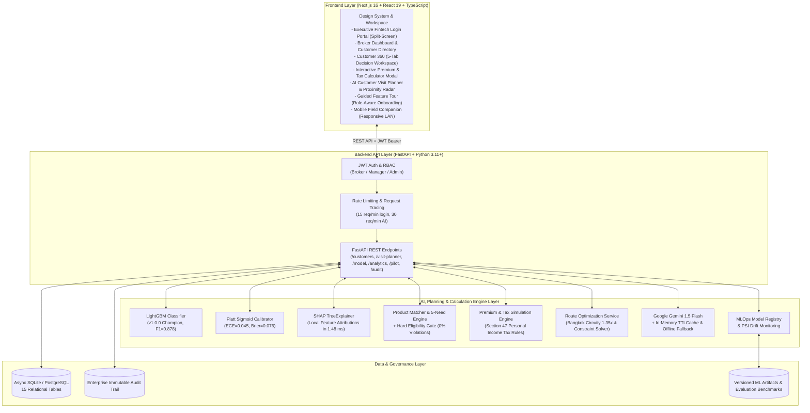

# Broker Insight AI — AI-Powered Decision Support Workspace for Insurance Brokers

[](https://fastapi.tiangolo.com)
[](https://nextjs.org)
[](https://www.typescriptlang.org)
[](https://lightgbm.readthedocs.io)
[](https://shap.readthedocs.io)
[](https://www.python.org)
[-brightgreen.svg?style=flat)](docs/e2e-performance-report.md)
[](docs/e2e-performance-report.md)
[](docs/recommendation-optimization-report.md)
[](https://docs.pytest.org)
[](https://nodejs.org/api/test.html)

> **Positioning Statement:**  
> *Broker Insight AI* is an end-to-end AI decision-support workspace tailored for commercial and retail insurance brokers and financial advisors. It empowers brokers to prioritize high-value customer opportunities, understand explainable ML drivers via TreeSHAP, evaluate insurance products through hard eligibility gating, simulate premiums and tax deductions, plan intelligent multi-stop client visits, navigate on-demand, and prepare consultative conversations — all while strictly maintaining human-in-the-loop governance.

---

> ⚠️ **COMPLIANCE & DEMO DISCLAIMER:**
> - **Synthetic / Demo Data Only:** All customer profiles, financial balances, phone numbers, and policy records in this repository are synthetically generated for demonstration (`KS-00001` to `KS-00008`).
> - **Mock Downstream Integrations:** Core Banking, CRM, KYC, Policy Administration (PAS), and Payment transactions are implemented via safe in-process mock adapters.
> - **Human-in-the-Loop Advisory:** AI scoring, LLM insights, need matching, tax simulations, and route suggestions are consultative advisory tools. **The licensed broker retains full legal discretion and final authority over all customer recommendations and visits.**
> - **Status:** Enterprise Prototype — Pilot/Sandbox Ready (Comprehensive instrumentation ready; pending live operational deployment).

---

## 1. Executive Summary & Core Value Proposition

### 🚩 The Operational Challenges
Insurance brokers manage hundreds of client relationships across disconnected banking and legacy insurance systems:
1. **Siloed Customer Signals:** Financial liabilities, deposit trends, life events, and policy expiration dates reside in separate databases.
2. **Arbitrary Prioritization:** Spreadsheets and manual sorting cause brokers to miss critical protection gaps (e.g. maturing life policies, home loans without MRTA, new dependents without health coverage).
3. **Black-Box Skepticism:** Brokers reject opaque predictive scores unless they can inspect the exact underlying drivers (*"Why is this customer high priority today?"*).
4. **Inefficient Field Travel:** Brokers spend hours manually planning daily client visit routes without consideration of priority, traffic, or schedule feasibility.
5. **Regulatory & Advisory Compliance:** Communications must adhere to strict regulatory standards without high-pressure sales tactics or unsupported product suitability.

### 💡 The Solution: Broker Insight AI
An integrated, full-stack decision-support workspace that:
- **Unifies Customer 360° Data:** Centralizes assets, debts, existing coverage, transaction velocity, and KYC status into a single progressive-disclosure interface.
- **Calculates Calibrated Priority Scores:** Uses a **LightGBM Binary Classifier** ($F1=0.878$, $\text{ROC-AUC}=0.956$) calibrated via **Platt Sigmoid Scaling** ($\text{ECE}=0.045$, $\text{Brier}=0.076$).
- **Provides Local Explainability:** Computes **TreeSHAP** feature attributions to display positive and negative priority drivers in clear Thai explanations (latency 1.48 ms).
- **Enforces Hard Eligibility Gating:** Pre-filters insurance catalog items with hard business constraints (age, income, existing coverage) to guarantee 0% ineligible recommendations.
- **Simulates Premiums & Thai Tax Deductions:** Interactive calculator modal modeling Section 47 tax-deductible allowances (General Life up to 100k, Health up to 25k, Pension up to 200k/15%, Max 300k).
- **Optimizes Field Visits (AI Visit Planner):** Recommends feasible multi-stop itineraries based on priority scores, proximity radius (5/10/20 km), working hours, and traffic time.
- **Features an Executive Private Banking Login:** Premium split-screen authentication with Bangkok financial dusk visuals, enterprise security notices, and 1-click demo personas.
- **Enables Multi-Device Field Mobility:** Built with responsive touch ergonomics, LAN mobile access via `-H 0.0.0.0`, and 1-tap Google Maps navigation.
- **Standardizes Thai Typography:** Features an enterprise two-tier typography system with a strict 12px minimum font size and collision-free Thai diacritic line heights.
- **Preserves Human Primacy:** Brokers review, approve, modify, or reject AI recommendations with structured reasons, feeding continuous feedback into the MLOps registry.

---

## 2. System Architecture



---

## 3. Comprehensive Feature Modules (ภาพรวมฟีเจอร์สำคัญของระบบ)

Broker Insight AI ได้รับการออกแบบเป็นระบบช่วยตัดสินใจ (Decision-Support System) แบบครบวงจรสำหรับนายหน้าประกันภัยและที่ปรึกษาทางการเงิน ประกอบด้วยโมดูลสำคัญดังนี้:

### 🗺️ 1. ระบบวางแผนการเข้าพบลูกค้าอัจฉริยะ (AI Customer Visit Planner & Proximity Radar)
- **การคัดเลือกลูกค้าตามความคุ้มค่า (Intelligent Candidate Selection):** ดึงรายชื่อลูกค้าที่ควรเข้าพบโดยคำนวณจากคะแนนความสำคัญ AI, สถานะ KYC, และช่องว่างความคุ้มครอง
- **เรดาร์ค้นหาตามรัศมี (Proximity Radius Filter):** กรองลูกค้าในรัศมี 5 กม., 10 กม. หรือ 20 กม. จากพิกัดปัจจุบัน พร้อมระบบแจ้งเตือนความโปร่งใสกรณีลูกค้ายังไม่มีพิกัด GPS
- **การจำลองเส้นทางและคำนวณข้อจำกัด (Constraint-Aware Optimization):**
  - กำหนดเวลาเริ่ม-สิ้นสุดการทำงาน และเวลาพักรับประทานอาหารกลางวัน
  - คำนวณเวลาเดินทางจริงด้วยสัมประสิทธิ์ทางถนนกรุงเทพฯ (Bangkok Urban Circuity Factor $1.35\times$) พร้อมเวลาเข้าพบ 45 นาที/ราย
  - ให้คะแนนความเป็นไปได้ของตารางงาน (Schedule Feasibility Score 0–100%) ประมวลผลเสร็จในเวลา $<15\text{ ms}$
- **การนำทางแบบ On-Demand:** เชื่อมต่อ Google Maps Deep-link สำหรับนำทางแบบจุดต่อจุด โดยนายหน้าเป็นผู้สั่งการเองเสมอ
- **วงจรสถานะการเข้าพบ (Visit Lifecycle):** อัปเดตสถานะเสร็จสิ้น เลื่อนนัด หรือยกเลิก พร้อมย้ายหมุดเพื่อสแกนหาลูกค้ารอบตัวในจุดใหม่ทันที

### 👥 2. ฐานข้อมูลลูกค้าและมุมมอง 360° (Customer 360° Intelligence & 5-Need Analysis)
- **Customer Directory:** ค้นหา คัดกรองตามระดับความสำคัญ (High / Medium / Low), ผลิตภัณฑ์แนะนำ, สถานะ KYC, และเรียงตามคะแนนหรือระยะทาง
- **Customer 360 Profile (5 มิติ):** รวบรวมข้อมูลส่วนบุคคล, สินทรัพย์/หนี้สิน (สินเชื่อบ้าน, รถ, ธุรกิจ), กรมธรรม์ปัจจุบัน, ความเร่งด่วนของ Life Event และประวัติการติดต่อ
- **Coverage Gap Analyzer:** ระบุความเสี่ยงที่ยังไม่มีความคุ้มครอง เช่น มีสินเชื่อบ้านแต่ยังไม่มี MRTA หรือขาดประกันสุขภาพโรคร้ายแรง

### 🧠 3. โมเดล AI จัดลำดับความสำคัญและความโปร่งใส (Calibrated Scoring & TreeSHAP)
- **LightGBM Champion Model (v1.0.0):** ประเมินคะแนนความเร่งด่วน 0–100 จาก 17 ฟีเจอร์ทางการเงินและพฤติกรรม ($F1=0.878$, $\text{ROC-AUC}=0.956$)
- **Platt Sigmoid Calibration:** ปรับเทียบความน่าจะเป็นให้อยู่ในสเกลที่เที่ยงตรง ($\text{ECE}=0.045$, $\text{Brier}=0.076$)
- **TreeSHAP Local Explainability:** ถอดรหัสปัจจัยขับเคลื่อนเชิงบวกและลบ อธิบายเป็นภาษาไทยให้นายหน้าเข้าใจว่า *"ทำไมลูกค้ารายนี้ถึงเร่งด่วนในวันนี้"* ภายในเวลาเพียง 1.48 ms

### 🛡️ 4. ระบบแนะนำผลิตภัณฑ์พร้อม Hard Eligibility Gate (Recommendation Engine)
- **Pre-Ranking Hard Eligibility Gate (0% Violations):** คัดกรองเงื่อนไขตายตัว (อายุ, รายได้ขั้นต่ำ, ประวัติสุขภาพ, สินเชื่อที่มีอยู่) ก่อนเข้าสู่ขั้นตอนจัดอันดับ เพื่อรับประกันว่าลูกค้าจะไม่ได้รับข้อเสนอที่ผิดเกณฑ์ คปภ. 100%
- **5-Need Matching Logic:** จับคู่ความต้องการ 5 มิติ (Motor, Health, Life/MRTA, Savings, Retirement/Pension)
- **Human-in-the-Loop Discretion:** นายหน้ามีสิทธิ์ตรวจสอบ อนุมัติ ปรับเปลี่ยน หรือปฏิเสธคำแนะนำของ AI พร้อมระบุเหตุผลเพื่อส่งกลับเข้าสู่ระบบ MLOps Feedback Loop

### 💰 5. เครื่องคำนวณเบี้ยประกันและสิทธิลดหย่อนภาษี (Interactive Premium & Tax Calculator Modal)
- **Dynamic Premium Simulation:** คำนวณเบี้ยประกันตามเพศ อายุ และแผนความคุ้มครอง (ทุนประกันและค่ารักษาพยาบาล) แบบ Real-time
- **Section 47 Personal Income Tax Rules:** จำลองผลประโยชน์ทางภาษีเงินได้บุคคลธรรมดาตามมาตรา 47 แห่งประมวลรัษฎากร:
  - ประกันชีวิตทั่วไปและสะสมทรัพย์ (หักลดหย่อนได้สูงสุด 100,000 บาท)
  - ประกันสุขภาพตนเอง (หักลดหย่อนได้สูงสุด 25,000 บาท เมื่อรวมกับประกันชีวิตทั่วไปไม่เกิน 100,000 บาท)
  - ประกันชีวิตแบบบำนาญ (หักลดหย่อนได้สูงสุด 200,000 บาท และไม่เกิน 15% ของเงินได้พึงประเมิน รวมสูงสุด 300,000 บาท)
- **One-Pager Pitch Export:** นำตัวเลขสรุปความคุ้มครองและเบี้ยไปใช้ในบทสนทนาและเอกสารสรุปข้อเสนอได้ทันที

### 💬 6. เครื่องมือเตรียมตัวเข้าพบลูกค้า & สคริปต์สนทนา (Consultative Dialogue via LLM)
- **Google Gemini 1.5 Flash (v2.0-Optimized):** ร่างสคริปต์แนวทางการพูดคุยเชิงปรึกษา, จุดกระตุ้นความสนใจ (Trigger Events), และแนวทางตอบข้อโต้แย้งที่ตรงกับบริบทลูกค้า
- **Deterministic Safe Cache:** แคชผลลัพธ์ด้วย SHA-256 Hash เมื่อข้อมูลลูกค้าไม่มีการเปลี่ยนแปลง ช่วยลดเวลาตอบสนองเหลือ 0.15 ms และประหยัดค่าใช้จ่าย API ถึง 33.6%
- **Offline Fallback Engine:** มีระบบ Rule-Based Template สำรอง 100% พร้อมใช้งานทันทีแม้ไม่มีการเชื่อมต่ออินเทอร์เน็ต

### 🏛️ 7. หน้าจอเข้าสู่ระบบระดับไพรเวทแบงกิ้ง (Executive Private Banking Login Portal)
- **Modern Split-Screen Architecture:** ถ่ายทอดภาพทิวทัศน์ย่านการเงินกรุงเทพฯ ยามค่ำ (Bangkok Financial District Dusk) สื่อถึงความสง่างาม น่าเชื่อถือ และมั่นคง
- **1-Click Quick Demo Switcher:** สลับบทบาททดสอบได้ทันทีระหว่าง Broker, Manager, และ Admin
- **Enterprise Security Notices:** ข้อความระบุการกำกับดูแลความปลอดภัย ระบบข้อมูลสังเคราะห์ และหลักการจริยธรรม AI ตามแนวทางของ ธปท. และ คปภ.

### 📊 8. การกำกับดูแล ตรวจสอบ และ MLOps (Operations, Governance & Audit Trail)
- **Enterprise Immutable Audit Log (`/admin/audit`):** บันทึกทุกคำสั่งการอนุมาน (Inference), คำสั่ง LLM, การจำลองเส้นทาง, และการตัดสินใจของนายหน้าเพื่อการตรวจสอบย้อนกลับ (Compliance Trail)
- **AI Health & Explainability (`/model`):** ตรวจสอบประสิทธิภาพโมเดล, SHAP Summary Plot, และ Population Stability Index (PSI Drift Monitoring)
- **Business Analytics (`/analytics`):** วิเคราะห์ Conversion Rate, Approval Rate, และ Coverage Gap ในพอร์ตโฟลิโอ
- **Pilot Sandbox Evaluation (`/pilot`):** ชุดประเมินผลการทดสอบนำร่อง 8 สถานการณ์จำลอง พร้อมเครื่องมือจับเวลาการทำงาน

### 🌟 9. ระบบแนะนำการใช้งานสำหรับผู้ใช้ใหม่ (First-Time User Onboarding & Guided Tour)
- **Role-Aware Guided Tour:** ทัวร์แนะนำระบบแบบเจาะจงบทบาท (9 ขั้นตอนสำหรับ Broker, 5 ขั้นตอนสำหรับ Manager, 5 ขั้นตอนสำหรับ Admin)
- **Interactive Spotlight:** ระบบไฟสปอตไลต์ไฮไลต์สีทองรอบปุ่มเป้าหมาย พร้อมรองรับคีย์บอร์ด (`Esc`, ลูกศรซ้าย/ขวา) และปุ่ม `?` เพื่อเปิดดูซ้ำได้ตลอดเวลา

### 📱 10. ระบบตัวอักษรภาษาไทยระดับองค์กร & รองรับอุปกรณ์พกพา (Thai Typography & Mobile LAN)
- **Two-Tier Typography Hierarchy:** ใช้ฟอนต์ UI Sans-Serif (`Prompt`, `Noto Sans Thai`) สำหรับตารางและปุ่มกด และ Reading Serif (`Noto Serif Thai`, `Sarabun`) สำหรับบทวิเคราะห์ขนาดยาว
- **Diacritic Collision-Free:** ปรับแต่งความสูงบรรทัดป้องกันสระ-วรรณยุกต์ไทยซ้อนทับกัน และจำกัดขนาดตัวอักษรขั้นต่ำที่ 12px ทั่วทั้งระบบ
- **Mobile LAN Access:** รัน Dev Server ด้วย `-H 0.0.0.0` รองรับการทดสอบใช้งานจริงบนสมาร์ตโฟนหรือแท็บเล็ตผ่าน Wi-Fi เครือข่ายเดียวกัน

---

## 4. Single Source of Truth Metrics

ตัวเลขชี้วัดทั้งหมดได้รับการตรวจสอบและอ้างอิงจาก Artifacts การประเมินผลของระบบจริง ([`docs/master-evidence-registry.json`](docs/master-evidence-registry.json)):

| หมวดหมู่ | ตัวชี้วัด (Metric) | ค่าที่วัดได้จริง | เกณฑ์มาตรฐาน | แหล่งที่มา / ข้อมูลอ้างอิง |
|---|---|:---:|:---:|---|
| **ML Scoring** | **Holdout Test F1** | **0.878** | $\ge 0.80$ | 80/20 Holdout Test (`baseline.json`) |
| | **5-Fold CV F1** | **0.857** | $\ge 0.80$ | Stratified Cross-Validation (`evaluation_metrics.json`) |
| | **ROC-AUC** | **0.956** | $\ge 0.85$ | High discriminative power (`baseline.json`) |
| | **Precision / Recall** | **0.859 / 0.898** | $\ge 0.75 / \ge 0.80$ | Holdout Test evaluation (`baseline.json`) |
| | **Brier Score** | **0.076** | $\le 0.15$ | Platt Sigmoid Calibration (`calibration_metrics.json`) |
| | **ECE (Holdout)** | **0.045** | $\le 0.10$ | Expected Calibration Error (`calibration_metrics.json`) |
| | **Demographic Parity** | **0.96** | $\ge 0.80$ | Four-Fifths Rule Passed (`fairness_report.json`) |
| **Recommendation** | **Gating Violations** | **0.0%** | **0.0%** | Pre-ranking hard gate (`recommendation_evaluation.json`) |
| | **Top-1 / Top-K Match** | **100.0%** | $\ge 85.0\%$ | Representative pilot scenarios (`recommendation_evaluation.json`) |
| | **Average Latency** | **0.86 ms** | $\le 5.0\text{ ms}$ | High-throughput sub-millisecond filtering |
| **Generative AI** | **Token Reduction** | **-17.0%** | $\ge 10.0\%$ | Prompt & Output budget optimization (`llm_optimized.json`) |
| | **Cost per 1k Requests** | **$0.229 USD** | $\le \$0.35$ | 33.6% cost reduction via TTLCache |
| | **Cache Hit Latency** | **0.15 ms** | $\le 1.0\text{ ms}$ | SHA-256 Safe Content Caching |
| | **Guardrail Failures** | **0.0%** | **0.0%** | Zero high-pressure or misleading claims |
| **Visit Planning** | **Feasibility Accuracy** | **100.0%** | **100.0%** | Working hours & travel limits (`test_visit_planner.py`) |
| | **Solver Latency** | **< 15 ms** | $\le 50\text{ ms}$ | Matrix distance & constraint resolution |
| **End-to-End System** | **Workflow Latency (Warm)**| **35.09 ms** | $\le 150\text{ ms}$ | Full 10-Step Broker Lifecycle (`e2e_optimized.json`) |
| | **Workflow Latency (Cold)**| **57.93 ms** | $\le 250\text{ ms}$ | Full 10-Step Broker Lifecycle (`e2e_optimized.json`) |
| | **Peak Throughput** | **3,480 req/s** | $\ge 1,000\text{ req/s}$ | Concurrency load testing at 50 users |
| | **Error Rate Under Load**| **0.00%** | $\le 0.1\%$ | Zero failure across all benchmark scenarios |
| **Quality & Tests** | **Backend Pytest** | **235 / 235 Passed** | **100%** | Async client Pytest test suites |
| | **Frontend Tests** | **31 / 31 Passed** | **100%** | Node test suites (Typography, Tour, Planner) |
| | **TypeScript Errors** | **0 Errors** | **0** | `npx tsc --noEmit` clean compilation |
| | **Sub-12px Font Sizes** | **0 (0.0%)** | **0** | AST & CSS audit across entire frontend |

---

## 5. Technology Stack

* **Frontend:** Next.js 16 (App Router), React 19, TypeScript 5, Vanilla CSS Enterprise Design System, Lucide Icons.
* **Backend:** FastAPI (Python 3.11+), Uvicorn, Pydantic v2, Async SQLAlchemy, SQLite (Development) / PostgreSQL (Production).
* **Machine Learning:** LightGBM 4.6+, Scikit-learn (Platt Sigmoid Calibration), SHAP 0.46+ (TreeExplainer).
* **Route & Spatial Engine:** Pure-Python Constraint Solver, Haversine Engine with Bangkok Circuity Modeling ($1.35\times$).
* **AI & LLM:** Google Gemini 1.5 Flash, In-Memory TTLCache, Rule-Based Fallback Engine.
* **Security & Auth:** PyJWT, Passlib (Argon2 / BCrypt), Role-Based Access Control (`broker`, `manager`, `admin`).
* **Testing & Governance:** Pytest (235 tests), Node.js Native Test Runner (31 tests), Immutable Audit Logger.

---

## 6. Reproducible Setup Guide

### Prerequisites
- Python 3.11+
- Node.js 20+ & npm
- Git

### 1. Clone Repository & Setup Environment
```bash
git clone https://github.com/Chalermsak1/broker-insight-ai-krungsri-hackathon.git
cd broker-insight-ai-krungsri-hackathon
```

### 2. Backend Setup
```bash
cd backend
python3 -m venv .venv
source .venv/bin/activate

# Install dependencies
pip install -r requirements.txt

# Seed synthetic database & model artifacts
python seed_data.py

# Start FastAPI server
uvicorn app.main:app --host 0.0.0.0 --port 8000 --reload
```

### 3. Frontend Setup
```bash
cd ../frontend

# Install dependencies
npm install

# Run automated tests
npm test

# Start Next.js development server (accessible via localhost and mobile LAN)
npm run dev
```

เปิดเบราว์เซอร์ที่ `http://localhost:3000`  
*(หากต้องการเปิดดูผ่านโทรศัพท์มือถือที่เชื่อมต่อ Wi-Fi เดียวกัน ให้เปิดไปที่ `http://<IP_เครื่องคอมพิวเตอร์>:3000` เช่น `http://10.36.13.234:3000`)*

---

## 7. Demo Credentials & User Roles

> ⚠️ **ข้อมูลบัญชีสำหรับทดสอบระบบ (1-Click Demo Credentials Available on Login Page):**

| บทบาท (Role) | อีเมล (Email) | รหัสผ่าน (Password) | ขอบเขตการเข้าถึง (Access Scope) |
|---|---|---|---|
| **Broker (นายหน้า)** | `broker@demo.local` | `demo1234` | Workspace (`/dashboard`, `/customers`, `/customers/[id]`, `/visit-planner`, `/my-protection`) |
| **Manager (ผู้จัดการ)** | `manager@demo.local` | `demo1234` | Workspace + Operations (`/analytics`, `/model`, `/pilot`) |
| **Admin (ผู้ดูแลระบบ)** | `admin@demo.local` | `demo1234` | Workspace + Operations + Governance (`/admin/audit`, Model Registry) |

---

## 8. License

This project is licensed under the MIT License — see the [LICENSE](LICENSE) file for details.
