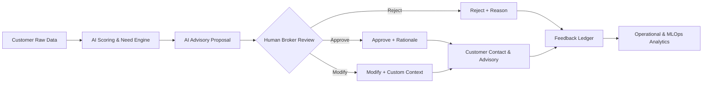

# Broker Insight AI — AI Safety & Governance Framework
**Phase 21 Comprehensive Safety, Privacy & Compliance Architecture Document**
*Date: 2026-08-30 | Status: Production Prototype Guardrails | Scope: LLM, ML, RBAC, and Audit Logging*

---

## 1. Core Principles of AI Governance

The **Broker Insight AI** platform is engineered under four foundational pillars:
1. **Human-in-the-Loop Supremacy:** AI generates consultative signals and drafts; the licensed broker retains full legal discretion and communication authority.
2. **Deterministic Information Minimization:** Only minimized, sanitized customer attributes are passed to external inference endpoints.
3. **Rigid Output Guardrails:** Every generative response is validated against strict Pydantic schemas, regulatory keyword filters, and groundedness verifiers.
4. **End-to-End Traceability:** Every data access, model inference, broker feedback decision, and follow-up is persisted in an immutable audit ledger.

---

## 2. Human-in-the-Loop (HITL) Workflow



### Key Decision Safeguards:
- **No Direct Automation:** The system **never** sends automated SMS, emails, or insurance offers directly to customers without broker review.
- **Mandatory Decision Rationale:** When modifying or rejecting AI recommendations, brokers select structured reasons (e.g. `customer_context_changed`, `existing_external_coverage`, `eligibility_issue`) to fuel continuous model refinement.

---

## 3. Multi-Layer AI Guardrails Architecture

```
[Customer Profile Data]
       │
       ▼
[Layer 1: Input Guardrails & Sanitizer]
  ├── Strip Secrets (api_key, tokens, password_hash)
  ├── Strip Sensitive PII (national_id, bank_account, phone, email)
  └── Neutralize Prompt Injections ("ignore previous instructions", "system override")
       │
       ▼
[Layer 2: Generative Inference (Gemini 1.5 Flash / Fallback Engine)]
       │
       ▼
[Layer 3: Pydantic Schema Validation]
  └── Enforce required keys: customer_summary, key_observations, potential_needs, cautions
       │
       ▼
[Layer 4: Regulatory & Prohibited Language Filter]
  ├── Block Guaranteed Returns ("รับประกันผลตอบแทน 100%", "ไม่มีทางขาดทุน")
  ├── Block Coercive Sales Pressure ("ต้องซื้อทันที", "ห้ามปฏิเสธ", "ปิดการขายด่วน")
  └── Block Deceptive Authority Claims ("คุ้มครองทุกกรณีไม่มีข้อยกเว้น")
       │
       ▼
[Layer 5: Fact Groundedness Verification]
  ├── Rejects false debt allegations for debt-free customers
  └── Rejects false excess coverage claims for uninsured customers
       │
       ├──[Passed]───────────────► [Verified AI Insight + Audit Trail]
       └──[Validation Failed]────► [Safe Deterministic Fallback Engine]
```

---

## 4. Data Minimization & Privacy Protection

- **Anonymized External Identifiers:** External IDs (`CUST-KS-101`) are used in AI prompts rather than full real identities.
- **PII Masking (`ENABLE_DATA_MASKING=True`):** Phone numbers (`081-***-5678`) and National IDs (`1-****-*****--8`) are masked on UI presentations for non-admin viewers.
- **No Customer Data Retention in Prompts:** Prompts are stateless and do not train base foundation models.

---

## 5. Model Lifecycle Governance (MLOps Registry)

- **Version Cataloging:** Every trained model is registered in `backend/app/ml/artifacts/registry/` with reproducible training provenance (random seed `42`, hyperparameters, library versions).
- **Validation Gate:** Only candidate models achieving $F1 \ge 0.80$, $\text{ROC AUC} \ge 0.85$, and $\text{ECE} \le 0.06$ can be promoted to `active`.
- **Audited Rollback:** Managers/Admins can revert to previous validated models (`POST /model/rollback`) in milliseconds without service interruption.
- **Population Stability Drift (PSI):** Real-time monitoring tracks feature distribution drift $P(X)$ and prediction drift $P(Y)$, flagging when $\text{PSI} \ge 0.25$.

---

## 6. Immutable Audit Trail

All system activities are recorded in the `audit_logs` database table:
- `USER_LOGIN` / `USER_LOGOUT`
- `CUSTOMER_VIEWED`
- `AI_ANALYSIS_REQUESTED` (capturing model name, score, SHAP top drivers)
- `RECOMMENDATION_DECISION` (Approve / Modify / Reject with structured reasons)
- `FOLLOWUP_CREATED` / `FOLLOWUP_COMPLETED`
- `MODEL_PROMOTED` / `MODEL_ROLLBACK`

*Access Control:* Audit logs can only be inspected by users with the `admin` role.
