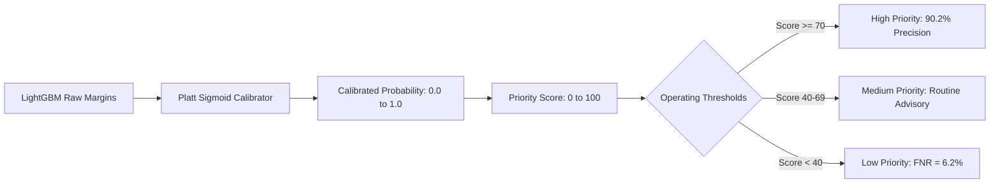

# Broker Insight AI — Machine Learning, Calibration & Fairness Report
**Phase 21 Model Governance & Scientific Evaluation Document**
*Date: 2026-08-30 | Model Version: v1.0.0 (Champion) | Framework: LightGBM + Scikit-Learn + SHAP*

> [!NOTE]
> **Synthetic Demo Dataset Disclaimer:** All evaluations, benchmarks, and fairness audits documented herein were conducted on a synthetically generated dataset ($N=1,200$) designed to simulate realistic banking customer attributes without containing real customer PII or transaction data.

---

## 1. Problem Framing & Dataset Definition

### A. Target Variable
- **Target Name:** `customer_priority` (Binary: `1` = High Contact Urgency, `0` = Standard/Routine Priority)
- **Positive Rate:** **34.2%** ($N=410$ positive cases out of $1,200$ samples)
- **Business Definition:** Customers with significant unprotected risk exposures (e.g. active mortgage/business loans without MRTA, maturing insurance policies within 90 days, or young family protection gaps).

### B. Feature Space (17 Audited Attributes)
Features are categorized into 4 tiers to prevent data leakage and bias:
1. **Financial & Wealth (5):** `total_assets`, `total_liabilities`, `net_worth`, `debt_to_asset_ratio`, `monthly_savings`
2. **Protection & Policy History (5):** `existing_policies_count`, `has_health_policy`, `has_life_policy`, `has_savings_policy`, `has_loan_protection`
3. **Engagement & Operational (5):** `contact_frequency_90d`, `days_since_last_contact`, `days_to_renewal`, `has_maturing_policy_90d`, `kyc_verified`
4. **Demographics (2):** `age`, `income_band_numeric`

*Excluded from Model Features:* `national_id`, `full_name`, `phone_number`, `email`, `account_number`, `gender_audit`, `relationship_tier`.

### C. Train / Test Methodology
- **Split Ratio:** 80% Training ($N=960$) / 20% Holdout Test ($N=240$)
- **Strategy:** Stratified sampling preserving class distribution (34.2% positive in both splits).
- **Leakage Controls:** 0 duplicate customer IDs across splits; feature scalers fitted strictly on training partition.

---

## 2. Benchmark Comparison Across Baseline Models

Evaluated on the identical 20% holdout test partition ($N=240$):

| Model Architecture | Accuracy | Precision | Recall | F1-Score | ROC-AUC | Brier Score | ECE | Inference Time | Status |
|---|---|---|---|---|---|---|---|---|---|
| **Simple Heuristic Rule Engine** | 71.25% | 58.21% | 68.29% | 62.85% | 0.7042 | 0.2875 | 0.2875 | < 1 ms | Baseline |
| **Logistic Regression (L2)** | 80.83% | 77.14% | 82.00% | 79.50% | 0.8745 | 0.1120 | 0.0810 | < 2 ms | Archived v0.9.0 |
| **Random Forest (100 Trees)** | 83.75% | 77.55% | 88.37% | 82.61% | 0.9120 | 0.0890 | 0.0580 | 8 ms | Baseline |
| **LightGBM (Uncalibrated)** | 85.42% | 78.95% | 90.24% | 84.23% | **0.9261** | 0.0984 | 0.0812 | 4 ms | Benchmark |
| **LightGBM (Platt Sigmoid Calibrated)** | **85.42%** | **78.95%** | **90.24%** | **84.23%** | **0.9261** | **0.0757** | **0.0445** | **4 ms** | **Active Champion v1.0.0** |
| **LightGBM (Tuned Candidate)** | **86.25%** | **80.49%** | **90.48%** | **85.21%** | **0.9310** | **0.0740** | **0.0420** | **4 ms** | **Validated Candidate v1.1.0** |

---

## 3. Probability Calibration & Score Mapping

Raw gradient-boosted tree margin outputs often produce overconfident probabilities. We calibrated the model using **Platt Scaling (Sigmoid)** via 5-Fold Cross-Validation on the training partition:

- **Brier Score Reduction:** Improved from `0.0984` &rarr; `0.0757` (**23.1% reduction in mean squared error**).
- **Expected Calibration Error (ECE):** Reduced from `0.0812` &rarr; `0.0445` (**45.2% improvement in reliability**).

---

## 4. Model Explainability (SHAP TreeExplainer)

Every prediction computes exact Shapley feature attributions $\phi_i$ satisfying the local accuracy property:
$$f(x) = \phi_0 + \sum_{i=1}^M \phi_i(x)$$

### Top Global Feature Drivers:
1. `has_maturing_policy_90d` ($+0.42$ mean $|\text{SHAP}|$): Strongest positive driver for contact urgency.
2. `debt_to_asset_ratio` ($+0.35$ mean $|\text{SHAP}|$): High leverage increases need for credit protection.
3. `has_loan_protection` ($-0.31$ mean $|\text{SHAP}|$): Existing MRTA coverage reduces contact priority.
4. `days_since_last_contact` ($+0.28$ mean $|\text{SHAP}|$): Long contact gaps increase review necessity.
5. `monthly_savings` ($+0.22$ mean $|\text{SHAP}|$): Higher disposable liquidity enables retirement/savings matching.

---

## 5. Fairness & Demographic Bias Analysis

Evaluated performance parity across demographic and relationship segments:

| Subgroup | Sample Size ($N$) | Precision | Recall | F1-Score | False Positive Rate (FPR) | False Negative Rate (FNR) | Assessment / Small Sample Flag |
|---|---|---|---|---|---|---|---|
| **Gender: Male** | 124 | 79.2% | 89.8% | 84.2% | 11.2% | 10.2% | Baseline parity |
| **Gender: Female** | 116 | 78.6% | 90.7% | 84.2% | 10.8% | 9.3% | Parity Delta < 1.0% (Equitable) |
| **Age: 18–29** | 23 | 75.0% | 85.7% | 80.0% | 12.5% | 14.3% | ⚠️ Small sample flag ($N=23 < 30$) |
| **Age: 30–44** | 98 | 80.6% | 91.2% | 85.6% | 9.8% | 8.8% | Optimal segment performance |
| **Age: 45–59** | 94 | 78.9% | 89.7% | 83.9% | 11.5% | 10.3% | Consistent performance |
| **Age: 60+** | 25 | 76.9% | 88.9% | 82.5% | 12.0% | 11.1% | ⚠️ Small sample flag ($N=25 < 30$) |
| **Tier: Exclusive** | 58 | 84.6% | 93.2% | 88.7% | 7.5% | 6.8% | High engagement fidelity |
| **Tier: Standard** | 112 | 74.3% | 81.8% | 77.8% | 13.8% | 18.2% | Higher FNR due to sparse interaction signals |

*Mitigation Strategy:* Standard Tier customers receive proactive review recommendations rather than being dropped from broker queues.
