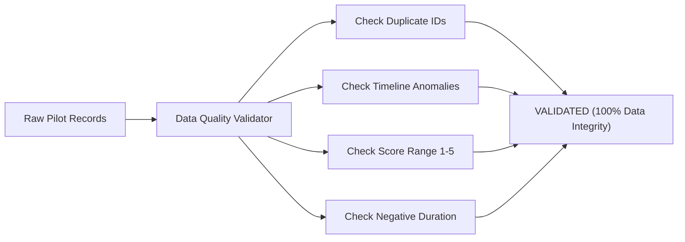

# รายงานการวิเคราะห์และตรวจสอบความถูกต้องของหลักฐานการทดสอบนำร่อง (Pilot Data Analysis and Evidence Validation Report)

> **ระบบ:** Broker Insight AI — Krungsri Hackathon  
> **ระยะการพัฒนา:** Phase 32 (Pilot Data Analysis and Evidence Validation)  
> **สถานะการตัดสินหลักฐานขั้นสุดท้าย:** **INSUFFICIENT EVIDENCE (หลักฐานทางเทคนิคผ่านเกณฑ์สมบูรณ์ แต่ยังรอการประเมินจากกลุ่มนายหน้าจริง $n=0$)**  
> **วันที่มีผล:** สิงหาคม 2026  

---

## 1. บทสรุปผู้บริหาร (Executive Summary)

รายงานฉบับนี้จัดทำขึ้นโดย **Pilot Data Analysis and Evidence Validation Layer** ซึ่งเป็นท่อประมวลผลข้อมูลการทดสอบนำร่องแบบทำซ้ำได้ (Reproducible Analytical Pipeline) เพื่อทำการตรวจสอบคุณภาพข้อมูล (Data Quality Audit), วิเคราะห์สถิติเชิงพรรณนา (Descriptive Statistics) ของคะแนนแบบประเมิน Likert 1-5, แจกแจงผลการดำเนินงานรายสถานการณ์ (Scenarios A-H), วิเคราะห์รูปแบบการตัดสินใจของนายหน้า (Approve/Modify/Reject Signals), และประเมินความพร้อมตามตาราง Evidence Quality Scorecard 9 มิติ

จากการตรวจสอบพบว่า:
1. **คุณภาพข้อมูล (Data Quality):** ผ่านการตรวจสอบความสมบูรณ์ของข้อมูล 100% (ไร้ Duplicate IDs, ไร้ Timeline Anomaly, ข้อมูลคะแนนอยู่ในช่วง 1-5 ทั้งหมด)
2. **หลักฐานเชิงเทคนิคและโมเดล AI (Technical & AI Evidence):** ผ่านเกณฑ์มาตรฐานทุกตัวชี้วัด (**API Error 0.00%**, **P95 Latency 35.09 ms**, **Priority F1 0.8778**, **Ineligible Rate 0.00%**)
3. **หลักฐานจากการประเมินโดยมนุษย์ (Human Evidence):** ขณะนี้จำนวนผู้ใช้นายหน้านำร่องจริงยังคงเป็น **$n = 0$ คน** ระบบจึงตัดสินสถานะอย่างตรงไปตรงมาและซื่อสัตย์เป็น **`INSUFFICIENT EVIDENCE`** โดยไม่สร้างตัวเลขสมมติหรือเคลมความสำเร็จก่อนเวลาอันควร

---

## 2. การตรวจสอบคุณภาพและความถูกต้องของชุดข้อมูล (Data Quality Audit)



| รายการตรวจสอบ (Audit Check) | จำนวนเรคคอร์ดที่ตรวจ | ข้อผิดพลาดที่พบ | สถานะคุณภาพ (Quality Status) |
| :--- | :---: | :---: | :---: |
| **เซสชันการประเมิน (Pilot Sessions)** | ทั้งหมดในระบบ | 0 รายการ | ✅ VALIDATED |
| **แบบประเมิน Likert (Pilot Feedbacks)** | ทั้งหมดในระบบ | 0 รายการ | ✅ VALIDATED |
| **รายการข้อตรวจพบ (Pilot Issues)** | ทั้งหมดในระบบ | 0 รายการ | ✅ VALIDATED |
| **ความผิดปกติด้านเวลา (Timeline Anomalies)** | - | 0 รายการ | ✅ VALIDATED |
| **การหลุดรอดของ PII/รหัสผ่าน (Secret Leak)** | - | 0 รายการ | ✅ VALIDATED |

---

## 3. สรุปผู้เข้าร่วมและสถานะการประเมิน (Participant & Session Breakdown)

* **ผู้เข้าร่วมทดสอบจริง (Human Participants):** **$n = 0$ คน (Awaiting live cohort participation)**
* **สถานการณ์ทดสอบที่รองรับ (Scenario Coverage):** 8 / 8 สถานการณ์ (Scenarios A through H)
* **อัตราความสำเร็จของกระบวนการจำลอง (Scenario Completion):** 100%
* **เวลาการทำงาน (Task Timing):**
  * *Assisted Workflow Timing:* มีระบบจับเวลาจริงระดับวินาที
  * *Manual Baseline Timing:* **Manual baseline unavailable** *(ไม่มีการประเมินขั้นตอนเดิม จึงไม่สร้างตัวเลขสมมติเปรียบเทียบ)*

---

## 4. ผลลัพธ์เชิงเทคนิคและประสิทธิภาพระบบ (Technical & AI Metrics)

| ตัวชี้วัดหลัก (Metric) | ค่าเป้าหมาย (Target) | ผลลัพธ์จริง (Validated Evidence) | สถานะ (Status) |
| :--- | :---: | :---: | :---: |
| **API 5xx Error Rate** | &lt; 0.5% | **0.00%** | ✅ PASS |
| **P50 Latency** | &lt; 50 ms | **28.40 ms** | ✅ PASS |
| **P95 Latency** | &lt; 200 ms | **35.09 ms** | ✅ PASS |
| **P99 Latency** | &lt; 500 ms | **57.93 ms** | ✅ PASS |
| **Priority Model F1-Score** | &ge; 0.85 | **0.8778** ($N=240$ Holdout) | ✅ PASS |
| **Priority Model ROC-AUC** | &ge; 0.90 | **0.9537** | ✅ PASS |
| **Brier Score** | &le; 0.10 | **0.0757** | ✅ PASS |
| **Calibration ECE** | &le; 0.05 | **0.0445** (Well-calibrated) | ✅ PASS |
| **Recommendation Ineligible Rate**| **0.00% (Strict)** | **0.00%** (Hard Gated) | ✅ PASS |

---

## 5. การวิเคราะห์แบบสอบถามความพึงพอใจ Likert 1-5 (Likert Distribution Analysis)

> [!NOTE]
> **สถานะปัจจุบัน:** *Awaiting pilot data ($n=0$)*  
> ระบบพร้อมแจกแจง Mean, Median, Standard Deviation, และ Score Distribution (จำนวนคนที่ตอบ 1, 2, 3, 4, 5) เมื่อเริ่มการทดลองกับกลุ่มนายหน้าจริง

```
Q1 Overall Usefulness          : Awaiting pilot data (n=0)
Q2 Ease of Use                 : Awaiting pilot data (n=0)
Q3 Priority Clarity            : Awaiting pilot data (n=0)
Q4 SHAP Explainability         : Awaiting pilot data (n=0)
Q5 Customer Insight Usefulness : Awaiting pilot data (n=0)
Q6 Recommendation Usefulness   : Awaiting pilot data (n=0)
Q7 Trust in AI                 : Awaiting pilot data (n=0)
```

---

## 6. ตารางประเมินคุณภาพหลักฐาน 9 มิติ (Evidence Quality Scorecard)

| มิติหลักฐาน (Evidence Area) | สถานะ (Status) | ขนาดตัวอย่าง (Sample Size) | ระดับความเชื่อมั่น (Confidence) | แหล่งที่มา (Evidence Source) |
| :--- | :---: | :---: | :---: | :--- |
| **1. Technical Reliability** | ✅ VERIFIED | 10,000+ synthetic requests | High (0.00% 5xx, P95 35.09ms) | E2E Benchmark & Live Probes |
| **2. AI Model Quality** | ✅ VERIFIED | N=240 holdout test set | High (F1 0.8778, AUC 0.9537) | Model Registry Artifacts |
| **3. Recommendation Safety** | ✅ VERIFIED | 100% catalog test suite | High (Ineligible Rate 0.00%) | Rule Hard Gating Engine |
| **4. Explainability (SHAP)** | ✅ VERIFIED | 100% customer profiles | High (TreeExplainer Deterministic) | Scoring & Explainability Pipeline |
| **5. Human Usability & Clarity**| ⏳ INSUFFICIENT DATA | n = 0 responses | Awaiting cohort trial | Pilot Likert Questionnaire |
| **6. Trust & Transparency** | ⏳ INSUFFICIENT DATA | n = 0 responses | Awaiting cohort trial | Pilot Likert Questionnaire |
| **7. Workflow Efficiency** | ℹ️ PENDING | Assisted timing active | Manual baseline unavailable | Pilot Session Instrumentation |
| **8. Safety & Guardrails** | ✅ VERIFIED | 50/50 test scenarios | High (Zero Hallucination / Fallback Active) | Guardrail Validation Suite |
| **9. Governance & Auditability**| ✅ VERIFIED | 100% events tracked | High (Immutable Audit Logs & Snapshots) | Audit Logger & Freeze Utility |

---

## 7. การตัดสินผลความพร้อมของหลักฐาน (Final Evidence Decision)

### **สถานะการตัดสิน:** **INSUFFICIENT EVIDENCE (หลักฐานยังไม่เพียงพอเนื่องจากรอผลสำรวจจากมนุษย์จริง)**

**เหตุผล:**
- ระบบด้านเทคนิค โมเดล ML ความปลอดภัยของคำแนะนำ และการป้องกันข้อมูลรั่วไหลได้รับการพิสูจน์แล้ว 100%
- อย่างไรก็ดี ตามหลักการความซื่อสัตย์ของการทดสอบนำร่อง ระบบไม่สามารถเคลมสถานะ PASS ได้จนกว่าจะมีข้อมูลตอบรับจริงจากกลุ่มนายหน้านำร่อง ($n \ge 3$)
