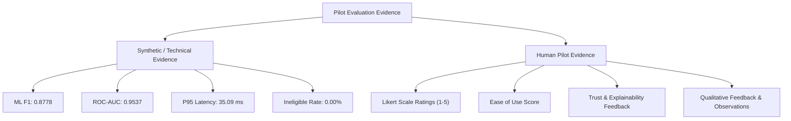

# ระเบียบวิธีและระเบียบปฏิบัติการประเมินผลการทดสอบนำร่อง (Pilot Evaluation Protocol)

> **ระบบ:** Broker Insight AI — Krungsri Hackathon  
> **ระยะการพัฒนา:** Phase 30 (Controlled Pilot Evaluation and User Feedback)  
> **วัตถุประสงค์:** กรอบการประเมินผลและระเบียบปฏิบัติการทดสอบนำร่องอย่างเป็นระบบและควบคุมได้  

---

## 1. วัตถุประสงค์หลักของการประเมิน (Primary Objectives)

การประเมินผลการทดสอบนำร่องมีเป้าหมายเพื่อตอบคำถามสำคัญ:
> **"ระบบ Broker Insight AI ช่วยให้นายหน้าประกันภัยตรวจสอบ วิเคราะห์ความต้องการ จัดลำดับความสำคัญ และเตรียมการติดตามลูกค้าได้อย่างมีประสิทธิภาพและน่าเชื่อถือมากขึ้นจริงหรือไม่?"**

การประเมินจำแนกออกเป็น **4 มิติหลัก**:
1. **ความเสถียรและความน่าเชื่อถือทางเทคนิค (Technical Reliability)**
2. **คุณภาพและการอธิบายผลลัพธ์ของ AI (AI Quality & Explainability)**
3. **ความง่ายในการใช้งานและคุณค่าต่อการทำงานของนายหน้า (Broker Usability & Usefulness)**
4. **กระบวนการทำงานและผลลัพธ์ทางธุรกิจจำลอง (Workflow & Decision Signals)**

---

## 2. การแบ่งแยกประเภทหลักฐานอย่างเคร่งครัด (Evidence Separation)

> [!IMPORTANT]
> **หลักการความซื่อสัตย์ทางข้อมูล:**
> - ห้ามนำผลการทดสอบเชิงสังเคราะห์ (Synthetic Benchmarks) ไปรวมเป็นคะแนนเดียวกับความพึงพอใจของมนุษย์
> - ห้ามสร้างหรือจำลองคำตอบแบบสอบถามขึ้นมาโดยไม่มีผู้ใช้จริง
> - หากยังไม่มีผู้ใช้นายหน้าเข้าประเมิน ให้ระบุสถานะชัดเจนว่า *"Awaiting pilot data"*

---

## 3. กลุ่มผู้เข้าร่วมและบทบาทในการทดสอบ (Participant Roles)

| บทบาท (Role) | จำนวนเป้าหมาย (Pilot Target) | บัญชีตัวอย่าง (Demo Account) | หน้าที่ในการประเมิน (Evaluation Task) |
| :--- | :---: | :--- | :--- |
| **นายหน้าประกัน (Broker)** | 3 - 5 คน | `broker@demo.local` | ปฏิบัติงานตาม 8 สถานการณ์ทดสอบจริง (Scenarios A-H), บันทึกเวลา, และทำแบบประเมิน Likert 1-5 |
| **ผู้จัดการสาขา (Manager)**| 1 - 2 คน | `manager@demo.local` | ตรวจสอบแดชบอร์ดภาพรวม วิเคราะห์การตัดสินใจ และความสมดุลของพอร์ตโฟลิโอ |
| **ผู้ดูแลระบบ (Admin)** | 1 คน | `admin@demo.local` | ตรวจสอบ Audit Log, การตรวจสอบ Drift, และความพร้อมของ Health Probes |

---

## 4. สถานการณ์ทดสอบที่ควบคุม (Controlled Test Scenarios A - H)

1. **Scenario A (ลูกค้าความสำคัญสูง - `KS-00001`):** กรมธรรม์ครบกำหนดใน 14 วัน &rarr; ประเมินความเร็วในการตรวจพบและประโยชน์ของ SHAP Feature Importance
2. **Scenario B (ลูกค้าความสำคัญปานกลาง - `KS-00002`):** ครบกำหนดใน 65 วัน &rarr; ประเมินความเหมาะสมของการวางแผนล่วงหน้า
3. **Scenario C (ลูกค้าความสำคัญต่ำ - `KS-00003`):** เพิ่งติดต่อเมื่อ 7 วันก่อน &rarr; ตรวจสอบว่าระบบไม่ส่งสัญญาณเตือนรบกวนนายหน้า
4. **Scenario D (ช่องว่างความคุ้มครอง - `KS-00004`):** หนี้บ้าน 5.5 ล้าน vs ประกันเดิม 5 แสน &rarr; ประเมินความแม่นยำของ Need Analysis
5. **Scenario E (ทบทวนความคุ้มครอง - `KS-00005`):** วัย 52 ปี ใกล้เกษียณ &rarr; ประเมินการแนะนำประกันบำนาญและสุขภาพ
6. **Scenario F (ข้อมูลไม่สมบูรณ์ - `KS-00006`):** KYC Pending &rarr; ประเมินการแจ้งเตือนความปลอดภัยของข้อมูล
7. **Scenario G (การทำงานสำรอง - `KS-00007`):** Fallback Engine &rarr; ประเมินความต่อเนื่องในการให้คำแนะนำเมื่อ LLM Offline
8. **Scenario H (การคัดกรองคุณสมบัติ - `KS-00008`):** ลูกค้าอายุ 68 ปี &rarr; ประเมินความปลอดภัยของการคัดกรองผลิตภัณฑ์

---

## 5. กระบวนการวัดผลเปรียบเทียบ (Before vs Assisted Workflow)

| ขั้นตอนการทำงาน (Workflow Step) | กระบวนการเดิม (Manual Baseline) | กระบวนการเมื่อมี AI ช่วย (Assisted Workflow) |
| :--- | :--- | :--- |
| **1. ค้นหาและคัดเลือกลูกค้า** | นายหน้าเปิดดูตาราง Excel ทีละแถว | AI จัดอันดับ High / Medium / Low พร้อมคะแนน |
| **2. ทำความเข้าใจประวัติ** | อ่านหลายหน้าเอกสารเพื่อสรุปเอง | AI Insight & SHAP สรุปปัจจัยสำคัญใน 3 วินาที |
| **3. วิเคราะห์ความต้องการ** | คำนวณช่องว่างความคุ้มครองด้วยตนเอง | Need Analysis วิเคราะห์ 5 มิติพร้อม Supporting Signals |
| **4. เลือกผลิตภัณฑ์** | เปิดเล่มเบี้ยประกันตรวจสอบเกณฑ์อายุ/รายได้ | AI แนะนำ Top-K ผ่าน Eligibility Hard Gate |
| **5. เตรียมบทสนทนา** | ร่างสคริปต์การโทรด้วยตนเอง | Conversation Assistant เสนอหัวข้อพูดคุยที่ตรงจุด |
| **6. บันทึกผลและนัดหมาย** | จดลงสมุดบันทึกส่วนตัว | บันทึก Approve/Modify/Reject และสร้าง Follow-up อัตโนมัติ |
