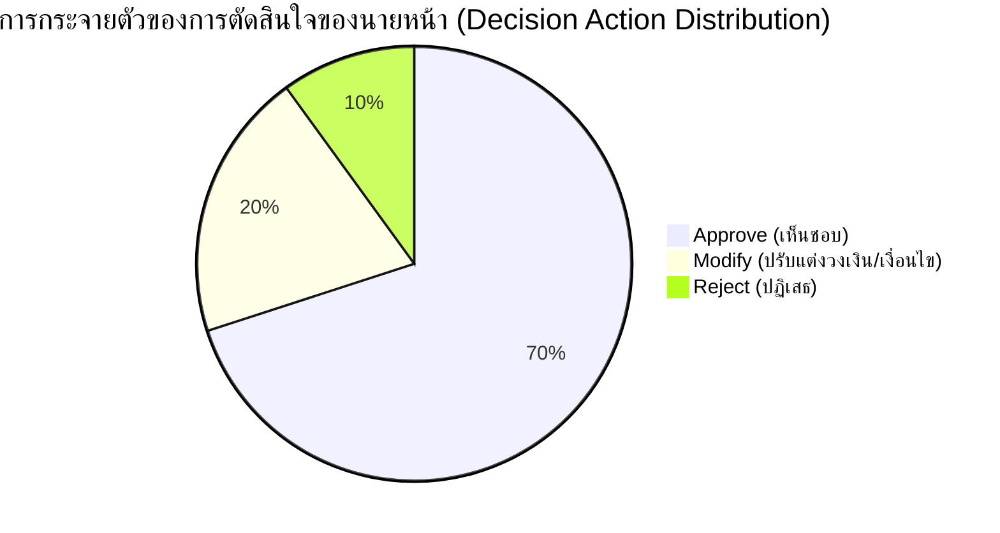

# ระเบียบวิธีวิเคราะห์ผลตอบรับและการตัดสินใจของนายหน้า (Pilot Feedback Analysis Framework)

> **ระบบ:** Broker Insight AI — Krungsri Hackathon  
> **ระยะการพัฒนา:** Phase 30  
> **วัตถุประสงค์:** กรอบการวิเคราะห์ผลตอบรับเชิงปริมาณและคุณภาพจากการทดสอบนำร่อง  

---

## 1. ระเบียบวิธีวิเคราะห์แบบประเมินความพึงพอใจ (Likert Scale Analysis)

แบบสอบถามความพึงพอใจใช้มาตรวัด 1 ถึง 5 (1 = น้อยที่สุด, 5 = มากที่สุด) ครอบคลุม 7 มิติ:
- **$Q_1$ (Overall Usefulness):** ประโยชน์และคุณค่าในภาพรวม
- **$Q_2$ (Ease of Use):** ความสะดวกและง่ายในการใช้งาน UI
- **$Q_3$ (Clarity of Priority):** ความเข้าใจในการจัดอันดับความสำคัญลูกค้า
- **$Q_4$ (SHAP Explainability):** ประโยชน์ของคำอธิบายปัจจัยสำคัญ
- **$Q_5$ (Customer Insight):** ความแม่นยำของสรุปพฤติกรรมลูกค้า
- **$Q_6$ (Product Recommendations):** ความตรงจุดของผลิตภัณฑ์ที่แนะนำ
- **$Q_7$ (Trust in AI):** ความไว้วางใจในการให้ AI เป็นผู้ช่วยสนับสนุน

### เกณฑ์การตีความคะแนนเฉลี่ย ($\bar{X}$):
- $\bar{X} \ge 4.20$: **ยอดเยี่ยม (Exceptional Adoption Readiness)**
- $3.80 \le \bar{X} < 4.20$: **ผ่านเกณฑ์มาตรฐานการทดสอบนำร่อง (Acceptable Pilot Target)**
- $3.00 \le \bar{X} < 3.80$: **ต้องปรับปรุงในส่วนที่ระบุ (Requires Refinement)**
- $\bar{X} < 3.00$: **ต้องทบทวนสถาปัตยกรรมหรือโมเดล AI ในส่วนนั้น (Major Re-work)**

---

## 2. กรอบการวิเคราะห์การตัดสินใจของนายหน้า (Human-in-the-Loop Decision Signals)

การตัดสินใจของนายหน้าต่อคำแนะนำของ AI ถูกบันทึกลงตาราง `broker_decisions` โดยแบ่งออกเป็น 3 รูปแบบ:

1. **Approve (เห็นชอบ):**
   - ตัวชี้วัด: สัดส่วนการยอมรับคำแนะนำ AI โดยตรง
   - การวิเคราะห์: ผลิตภัณฑ์ที่ได้รับการ Approve สูงบ่งชี้ว่า Rules และ Feature Weighting สอดคล้องกับพฤติกรรมตลาด
2. **Modify (ปรับแต่ง):**
   - ตัวชี้วัด: สัดส่วนที่นายหน้าปรับวงเงินความคุ้มครอง หรือเปลี่ยนระยะเวลาผ่อนชำระ
   - การวิเคราะห์: ใช้ระบุ Gap ระหว่างโปรไฟล์ลูกค้ามาตรฐานกับบริบทเฉพาะหน้าของลูกค้า
3. **Reject (ปฏิเสธ):**
   - ตัวชี้วัด: สัดส่วนที่นายหน้าไม่นำเสนอผลิตภัณฑ์ตามคำแนะนำ
   - การวิเคราะห์: นำเหตุผลที่บันทึก (Structured Reason) ไปวิเคราะห์เพื่อปรับปรุง Business Exclusion Rules

---

## 3. วงจรการปรับปรุงแบบควบคุม (Controlled Feedback Loop)

> [!WARNING]
> **ข้อห้ามสำคัญด้านความปลอดภัยและการกำกับดูแล:**
> - **ห้าม Retrain โมเดล ML อัตโนมัติจากผลตอบรับของนายหน้าโดยตรง** เพราะอาจทำให้เกิด Feedback Loop Bias หรือ Overfitting
> - **ห้ามปรับเปลี่ยนค่าน้ำหนัก Recommendation Engine แบบ Real-time โดยไม่ผ่านการทดสอบ Regression**

### ขั้นตอนการปรับปรุงที่ถูกต้อง (Controlled Change Process):
1. **รวบรวมข้อมูล:** สรุป Feedback และ Decision Override ประจำสัปดาห์
2. **วิเคราะห์สาเหตุ (Root Cause Analysis):** จำแนกว่าเป็นปัญหาด้านข้อมูล, กฎเกณฑ์ทางธุรกิจ, หรือ Prompt
3. **จำลองการเปลี่ยนแปลงใน Sandbox (Offline Validation):** ทดสอบกับชุดข้อมูลทดสอบ 240 รายการ
4. **ตรวจสอบ Regression & Fairness:** ยืนยันว่า Ineligible Rate ยังคงเป็น 0.00%
5. **ขออนุมัติการเลื่อนขั้น (Model / Rule Promotion):** เลื่อนขั้นเวอร์ชันผ่าน MLOps Model Registry
