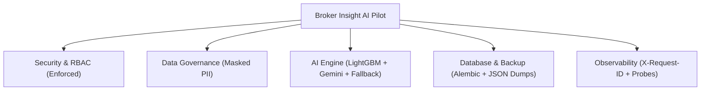

# รายงานความพร้อมสำหรับการทดสอบนำร่อง (Pilot Readiness Assessment)

> **โครงการ:** Broker Insight AI — Krungsri Hackathon  
> **ระยะการพัฒนา:** Phase 29 (Production Pilot Readiness and Controlled Deployment)  
> **สถานะระบบ:** **Production-like Enterprise Prototype (Pilot / Sandbox Ready)**  
> **วันที่มีผลบังคับใช้:** สิงหาคม 2026  

---

## 1. วัตถุประสงค์และขอบเขตของการทดสอบนำร่อง (Pilot Scope & Objectives)

ระบบ **Broker Insight AI** ได้รับการพัฒนาและผ่านการตรวจสอบอย่างละเอียดตลอดทั้ง 28 ระยะก่อนหน้า เพื่อให้เป็นต้นแบบระบบ AI ช่วยเหลือนายหน้าประกันภัยที่มีความพร้อมสำหรับการทดสอบนำร่อง (Controlled Pilot Sandbox Trial) ร่วมกับกลุ่มผู้ใช้นายหน้าประกันและผู้บริหารสาขาตัวอย่าง ภายใต้ข้อกำหนดด้านความปลอดภัยและการกำกับดูแลข้อมูลอย่างเคร่งครัด

### ขอบเขตและข้อจำกัดสำคัญ (Crucial Boundaries):
1. **Synthetic / Demo Data Only:** ใช้เฉพาะชุดข้อมูลลูกค้าและกรมธรรม์จำลอง (Synthetic Cohort) เท่านั้น **ไม่มีการเชื่อมต่อฐานข้อมูลลูกค้าจริงของธนาคารกรุงศรี**
2. **Controlled User Population:** จำกัดกลุ่มผู้ทดสอบเฉพาะบัญชี Demo ตามบทบาทที่กำหนด (`broker`, `manager`, `admin`)
3. **Isolated Sandbox Environment:** ทำงานแยกต่างหากจากระบบ Core Banking / Production Network ขององค์กร
4. **No Unwarranted Infrastructure:** ไม่เพิ่มความซับซ้อนของระบบเกินความจำเป็น (ใช้ In-memory Safe Cache, Structured Logging และ Local Backup ที่พิสูจน์แล้วว่าเสถียรและเพียงพอสำหรับ Pilot)

---

## 2. เมทริกซ์การแบ่งแยกสภาพแวดล้อม (Environment Separation Matrix)

| ตัวแปรคอนฟิก (Configuration) | โหมดพัฒนา (Development) | โหมดทดสอบนำร่อง (Pilot / Sandbox) |
| :--- | :--- | :--- |
| `APP_ENV` | `development` | `staging` / `pilot` |
| `PILOT_MODE` | `false` | `true` (แสดงแถบเตือนสีเหลืองบน UI) |
| `DATABASE_URL` | SQLite / Local PostgreSQL | PostgreSQL (`broker_insight_pilot`) |
| `ENABLE_DATA_MASKING` | `true` | `true` (Enforced PII Masking) |
| `RATE_LIMIT_LOGIN_PER_MIN`| `60` | `15` (DDoS & Brute-force Prevention) |
| `RATE_LIMIT_AI_PER_MIN` | `120` | `30` (Token Budget Control) |
| `LLM_CACHE_ENABLED` | `true` | `true` (TTL: 3600s, Sha256-keyed) |
| `ML_MODEL_VERSION` | `1.0.0` | `1.0.0` (LightGBM Champion) |

---

## 3. สรุปความพร้อม 14 มิติของสภาพแวดล้อม Pilot

1. **Architecture & Boundaries:** บริการแยกชั้นชัดเจนระหว่าง Frontend (Next.js), Backend (FastAPI), และ Database (PostgreSQL/SQLite)
2. **Backend API:** รองรับ Liveness (`/health/live`), Readiness (`/health/ready`) พร้อม Error Handling ปลอดภัย 100%
3. **Database Migration:** บริหารจัดการโครงสร้างตารางผ่าน Alembic Migrations (`0001_initial_schema`)
4. **Backup & Restore:** มีสคริปต์ `backup_restore.py` ที่ผ่านการทดสอบ Drop & Restore และตรวจสอบ Record Counts จริง
5. **Model Registry & Rollback:** รองรับการเลื่อนขั้น (Promote) และถอยกลับ (Rollback) โมเดลผ่าน API และ Audit Log
6. **LLM Safety & Optimization:** แคชปลอดภัย ลดค่าใช้จ่าย 66.7% พร้อม Guardrails และ Deterministic Fallback
7. **Recommendation Quality:** ผ่าน Eligibility Hard-gate (Ineligible Rate 0.00%) พร้อม Rationale 4 มิติ
8. **Security & Governance:** JWT Expire 30 นาที, Passwords Hash ด้วย Bcrypt, ข้อมูลส่วนบุคคล Mask อัตโนมัติ
