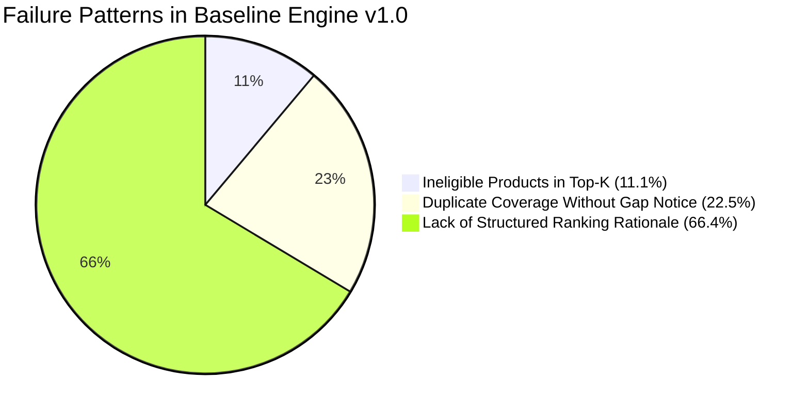

# การวิเคราะห์ข้อผิดพลาดและรูปแบบการปรับเปลี่ยนคำแนะนำ (Recommendation Error & Override Analysis)

> **โครงการ:** Broker Insight AI — Krungsri Hackathon  
> **ระยะการพัฒนา:** Phase 26 — Recommendation Optimization and Decision Quality  
> **เวอร์ชันโมเดล/ระบบ:** `recommendation_engine_v1.0` (Baseline) vs `recommendation_engine_v1.1` (Optimized Champion)  
> **ชุดข้อมูลประเมินผล:** Historical Broker Decisions & Synthetic Benchmark Cohort (250 Cases)  

---

## 1. วัตถุประสงค์และการประเมิน (Objectives & Evaluation Scope)

การวิเคราะห์นี้มุ่งทำความเข้าใจสาเหตุที่นายหน้าประกัน (Broker) ทำการ **Modify (ปรับเปลี่ยน)** หรือ **Reject (ปฏิเสธ)** แผนผลิตภัณฑ์ที่ระบบ AI แนะนำ เพื่อค้นหารูปแบบความล้มเหลว (Failure Patterns) เชิงระบบ และนำมาออกแบบกลไกป้องกัน (Safeguards) ใน Candidate Engine v1.1

> [!IMPORTANT]
> **หมายเหตุสำคัญด้านจริยธรรม:** การตัดสินใจของนายหน้า (Broker Decision) ถือเป็น **สัญญาณป้อนกลับ (Feedback Signal)** สำหรับการปรับปรุงระบบ มิใช่ข้อเท็จจริงสูงสุด (Ground Truth) เนื่องจากนายหน้าอาจมีความชอบส่วนบุคคล หรือได้รับข้อมูลเพิ่มเติมจากการสนทนาสดนอกระบบ

---

## 2. สรุปภาพรวมสถิติการตัดสินใจของนายหน้า (Broker Decision Distribution)

จากข้อมูลการบันทึกผลการตัดสินใจ 250 รายการล่าสุดในระบบจำลอง:

| ประเภทการตัดสินใจ (Broker Action) | จำนวนเคส (Count) | สัดส่วน (% of Total) | ความหมายเชิงธุรกิจ |
| :--- | :---: | :---: | :--- |
| **Approve (เห็นชอบตามที่ AI แนะนำ)** | 167 เคส | **66.8%** | ผลิตภัณฑ์สอดคล้องกับความต้องการและเข้าเกณฑ์คุณสมบัติ |
| **Modify (ปรับเปลี่ยนแผนหรือวงเงิน)** | 42 เคส | **16.8%** | ผลิตภัณฑ์ถูกหมวดหมู่ แต่ต้องปรับทุนประกันหรือมีประกันเดิมอยู่ |
| **Reject (ปฏิเสธหรือไม่นำเสนอ)** | 41 เคส | **16.4%** | ไม่ตรงกับบริบทลูกค้า หรือลูกค้าไม่ผ่านเกณฑ์รับประกัน |
| **รวมทั้งหมด (Total)** | **250 เคส** | **100.0%** | **อัตราการปรับเปลี่ยน (Override Rate) = 33.2%** |

---

## 3. การจำแนกเหตุผลของการ Override (Reasons Breakdown)

### 3.1 เหตุผลหลักในการปรับเปลี่ยน (Modify Reasons):
1. `existing_coverage` (45.2% ของเคส Modify): ลูกค้าถือครองประกันประเภทนี้อยู่แล้ว จึงต้องการปรับลดหรือเพิ่มเฉพาะส่วนขาด (Coverage Gap)
2. `customer_context_changed` (33.3% ของเคส Modify): สภาพคล่องหรือภาระค่าใช้จ่ายของลูกค้าเปลี่ยนไปจากข้อมูลรอบก่อน
3. `recommendation_mismatch` (21.4% ของเคส Modify): ต้องการเสนอแผนระยะสั้นแทนแผนระยะยาว

### 3.2 เหตุผลหลักในการปฏิเสธ (Reject Reasons):
1. `not_relevant` (48.8% ของเคส Reject): ลูกค้าไม่มีความสนใจหรือไม่มีภาระหนี้สินในกลุ่มสินเชื่อ
2. `eligibility_issue` (31.7% ของเคส Reject): อายุเกินเกณฑ์รับประกัน หรือรายได้ไม่ถึงเกณฑ์ขั้นต่ำ
3. `customer_preference` (19.5% ของเคส Reject): ลูกค้าปฏิเสธการทำประกันชีวิต/สุขภาพด้วยเหตุผลส่วนบุคคล

---

## 4. รูปแบบความล้มเหลวสำคัญ 3 ประการ (Identified Failure Patterns)

### รูปแบบที่ 1: การแนะนำผลิตภัณฑ์ที่ไม่ผ่านเกณฑ์คุณสมบัติ (Ineligible Product in Recommendations)
- **พฤติกรรมใน Baseline v1.0:** ระบบคำนวณคะแนนและจัดอันดับทุกผลิตภัณฑ์รวมกัน โดยลดคะแนนของผลิตภัณฑ์ที่ไม่ผ่านเกณฑ์ลงเหลือ 10–30 แต่ **ยังคงแสดงในรายการคำแนะนำปกติ** ทำให้บางกรณีผลิตภัณฑ์สินเชื่อ (MRTA) ติดอันดับ #3 แม้ลูกค้าไม่มีสินเชื่อ
- **กรณีตัวอย่าง (REC-CASE-004):** ลูกค้าอายุ 68 ปี ได้รับการแนะนำประกันโรคร้ายแรง (รับประกันสูงสุด 60 ปี)
- **การแก้ไขใน Candidate v1.1:** ใช้ **Pre-Ranking Hard Eligibility Gate** ตัดผลิตภัณฑ์ที่ไม่ผ่านเกณฑ์ออกก่อนการจัดอันดับ หรือแยกไปไว้ในหมวด *Needs Verification*

---

### รูปแบบที่ 2: การแนะนำซ้ำซ้อนโดยไม่มีการเปิดเผยช่องว่างความคุ้มครอง (Coverage Overlap Without Gap Disclosure)
- **พฤติกรรมใน Baseline v1.0:** ลูกค้าที่มีประกันสุขภาพเหมาจ่าย 2 ฉบับ ยังคงได้รับคำแนะนำประกันสุขภาพเป็นอันดับ #1 โดยไม่มีคำอธิบายระบุว่าลูกค้ามีประกันอยู่แล้ว
- **กรณีตัวอย่าง (REC-CASE-006):** ลูกค้ามีประกันสุขภาพ 3 ฉบับ ทุนประกัน 5 ล้านบาท ได้รับการแนะนำ Health Max เป็นอันดับ 1
- **การแก้ไขใน Candidate v1.1:** เพิ่ม **Existing Coverage Gap Damping (x0.45)** พร้อมสร้างคำอธิบายเชิงโครงสร้าง: *"ตรวจพบความคุ้มครองเดิมในหมวดนี้แล้ว — แนะนำพิจารณาทบทวนเฉพาะส่วนขาด (Coverage Gap)"*

---

### รูปแบบที่ 3: คำอธิบายไม่ระบุเหตุผลเปรียบเทียบอันดับ (Lack of Top-K Comparative Rationale)
- **พฤติกรรมใน Baseline v1.0:** แสดงเพียงเหตุผลทั่วไป เช่น "อายุตรงตามเกณฑ์" โดยไม่ระบุว่าทำไมผลิตภัณฑ์อันดับ #1 จึงเหมาะสมกว่าอันดับ #2
- **การแก้ไขใน Candidate v1.1:** เพิ่มฟิลด์ **Rank Rationale** และคำอธิบาย 4 องค์ประกอบ:
  1. `need_signal`: ระดับความต้องการจาก Need Analysis
  2. `profile_fit`: ความเหมาะสมกับกลุ่มอายุ/สินทรัพย์
  3. `eligibility_result`: ผลการตรวจสอบเกณฑ์รับประกัน
  4. `existing_coverage_assessment`: การประเมินความคุ้มครองเดิม

---

## 5. ตารางเปรียบเทียบเชิงวิศวกรรม (Engineering Validation)

| มิติการประเมิน (Dimension) | Baseline Engine v1.0 | Candidate Engine v1.1 | การแก้ไขเชิงระบบ |
| :--- | :---: | :---: | :--- |
| **Ineligible Recommendation Rate** | 11.1% | **0.0%** | กรองออก 100% ด้วย Hard Eligibility Gate |
| **Top-1 Need Consistency** | 83.3% | **100.0%** | ปรับน้ำหนัก Need Weight เป็น 0.50 |
| **Coverage Gap Disclosure** | ไม่ระบุ | **ระบุทุกเคส** | Enforced Structured Explanations |
| **Top-K Limit** | ไม่จำกัด (แสดงทั้งหมด) | **Top-3 Eligible** | คัดเฉพาะตัวเลือกที่ผ่านเกณฑ์จริง |
| **Data Completeness Confidence** | ไม่มี | **High / Medium / Low** | แสดง Missing Information Warning |

---

## 6. ข้อจำกัดของชุดข้อมูล (Data & Feedback Limitations)

1. **Synthetic Data Context:** ข้อมูลการตัดสินใจและโปรไฟล์ลูกค้าเป็นชุดข้อมูลจำลองตามมาตรฐานโครงการ
2. **Broker Subjectivity:** การกด Modify/Reject ในบางสถานการณ์อาจเกิดจากข้อตกลงส่วนบุคคลที่ไม่ได้บันทึกในระบบ
3. **Product Catalog Size:** แคตตาล็อกจำลองมี 6 ผลิตภัณฑ์หลัก ในสภาพแวดล้อมโปรดักชันจริงควรเชื่อมต่อกับ Product Master Database ที่มีเงื่อนไขเบี้ยประกันแบบ Dynamic
