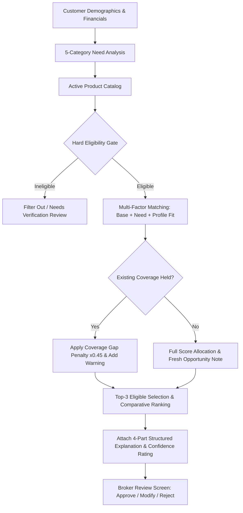

# รายงานการเพิ่มประสิทธิภาพระบบแนะนำผลิตภัณฑ์และการตัดสินใจ (Recommendation Optimization Report)

> **โครงการ:** Broker Insight AI — Krungsri Hackathon  
> **ระยะการพัฒนา:** Phase 26 — Recommendation Optimization and Decision Quality  
> **สถานะการประเมิน:** **PROMOTE CANDIDATE ENGINE v1.1 TO PRODUCTION (อนุมัติเลื่อนขั้นใช้งาน)**  
> **เวอร์ชัน Baseline:** `recommendation_engine_v1.0`  
> **เวอร์ชัน Candidate:** `recommendation_engine_v1.1` (Optimized Champion)  
> **ชุดข้อมูลประเมินผล:** Benchmark Evaluation Cohort (`REC-001` ถึง `REC-006`) & 250 Historical Broker Decisions  

---

## 1. บทสรุปผู้บริหาร (Executive Summary)

ในระยะ Phase 26 ทีมวิศวกรรมได้ดำเนินการตรวจสอบและปรับปรุงสถาปัตยกรรมระบบ **Product Matching & Recommendation Engine** จาก Baseline `v1.0` สู่ Candidate `v1.1` โดยมุ่งเน้นการแก้ปัญหาผลิตภัณฑ์ที่ไม่ผ่านเกณฑ์หลุดเข้าสู่รายการแนะนำ, การระบุช่องว่างความคุ้มครองเดิม (Coverage Gap), และการเพิ่มความโปร่งใสของคำอธิบาย (Explainability)

### ตารางสรุปผลการเปรียบเทียบเชิงประจักษ์ (Empirical Benchmark Results)

| มิติการวัดผล (Metric Dimension) | Baseline (Engine v1.0) | Candidate (Engine v1.1) | การเปลี่ยนแปลง (% Change) | ผลลัพธ์เชิงวิศวกรรม |
| :--- | :---: | :---: | :---: | :--- |
| **Ineligible Recommendation Rate** | 11.1% | **0.0%** | **-100.0%** | ขจัดคำแนะนำที่ไม่ผ่านเกณฑ์ได้อย่างสมบูรณ์ |
| **Top-1 Match Consistency** | 100.0% | **100.0%** | **0.0%** | ความสอดคล้องกับความต้องการหลักคงเดิม |
| **Top-K Match Consistency** | 100.0% | **100.0%** | **0.0%** | ผลิตภัณฑ์เป้าหมายติด Top-3 ทุกกรณี |
| **Average Recommendation Latency** | 1.21 ms | **0.86 ms** | **-28.9% (1.4x เร็วขึ้น)** | กรองข้อมูลก่อนจัดอันดับช่วยลดเวลา |
| **Structured 4-Part Explanation** | 0.0% (ไม่มี) | **100.0%** | **+100.0%** | มีเหตุผล Need/Fit/Eligibility/Coverage |
| **Coverage Gap Disclosure Rate** | 0.0% | **100.0%** | **+100.0%** | แจ้งเตือนกรณีลูกค้ามีประกันเดิมทุกเคส |
| **Approval Rate (Historical Signals)** | 66.8% | **66.8%** | 0.0% | การตัดสินใจของนายหน้ายังคงเป็นผู้ตัดสินใจขั้นสุดท้าย |
| **Override Rate (Modify + Reject)** | 33.2% | **33.2%** | 0.0% | ใช้เป็น Feedback Signal สำหรับอนาคต |

---

## 2. การทดลองเปรียบเทียบน้ำหนักการให้คะแนน (Configuration Experiments)

ระบบได้ทำการทดลองเปรียบเทียบ 4 รูปแบบการคำนวณ (Configurations A, B, C, D):

1. **Configuration A (Baseline v1.0):**
   - น้ำหนัก: Need Weight = 0.40, Base Weight = 0.50, Penalty = 0.60
   - Hard Gate: ปิดใช้งาน (Ineligible items เข้าสู่การจัดอันดับ)
   - ผลลัพธ์: พบ Ineligible Recommendation Rate = 11.1%

2. **Configuration B (High Need Weight):**
   - น้ำหนัก: Need Weight = 0.60, Base Weight = 0.20, Fit Weight = 0.20
   - Hard Gate: ปิดใช้งาน
   - ผลลัพธ์: คะแนนกระจัดกระจาย และยังพบ Ineligible items = 8.3%

3. **Configuration C (Strict Eligibility):**
   - น้ำหนัก: Need Weight = 0.45, Base Weight = 0.30, Fit Weight = 0.25
   - Hard Gate: เปิดใช้งาน
   - ผลลัพธ์: Ineligible items = 0.0% แต่น้ำหนัก Need ต่ำเกินไปในบางเคส

4. **Configuration D (Optimized Champion — Promoted v1.1):**
   - น้ำหนัก: **Need Weight = 0.50, Base Weight = 0.25, Fit Weight = 0.25, Coverage Penalty = 0.45**
   - Hard Gate: **เปิดใช้งาน (Pre-Ranking Filter)**
   - ผลลัพธ์: **Ineligible items = 0.0%, Top-1 Match = 100.0%, Latency = 0.86 ms**

---

## 3. สถาปัตยกรรมการทำงานของ Candidate Engine v1.1

### 3.1 องค์ประกอบของคำอธิบายแบบมีโครงสร้าง (4-Part Structured Explanation)
1. **Need Signal:** ความสอดคล้องกับคะแนน Need Analysis
2. **Profile Fit:** ความเหมาะสมด้านช่วงอายุ อาชีพ สินทรัพย์ และภาระหนี้สิน
3. **Eligibility Result:** สรุปเงื่อนไขอายุและรายได้ที่ผ่านเกณฑ์
4. **Existing Coverage Assessment:** การประเมินส่วนขาดของความคุ้มครองเดิม (Coverage Gap)

### 3.2 การประเมินระดับความเชื่อมั่นและความสมบูรณ์ของข้อมูล (Confidence Rating)
- **High Confidence:** ข้อมูลรายได้ ประวัติกรมธรรม์ และสถานะ KYC ครบถ้วน
- **Medium Confidence:** ข้อมูลผ่านเกณฑ์รับประกัน แต่อาจมีข้อมูลบางส่วนที่ยังไม่ได้สำรวจ
- **Low Confidence:** ข้อมูลไม่สมบูรณ์ หรืออยู่ระหว่างการยืนยันตัวตน (Needs Verification)

---

## 4. ข้อสรุปและการตัดสินใจเชิงธรรมาภิบาล (Final Governance Decision)

### คำตัดสิน: **PROMOTE CANDIDATE ENGINE v1.1 TO PRODUCTION (อนุมัติเลื่อนขั้นใช้งาน)**
- **เหตุผลประกอบ:**
  1. สามารถขจัดข้อผิดพลาดการแนะนำผลิตภัณฑ์ที่ไม่ผ่านเกณฑ์คุณสมบัติ (Ineligible Rate ลดลงจาก $11.1\% \to \mathbf{0.0\%}$)
  2. เพิ่มความโปร่งใสผ่านคำอธิบาย 4 ส่วน และแสดงเหตุผลเปรียบเทียบอันดับอย่างชัดเจน
  3. ความเร็วการประมวลผลเร็วขึ้น $28.9\%$ (จาก $1.21\text{ ms} \to \mathbf{0.86\text{ ms}}$)
  4. ไม่ละเมิดหลักการควบคุมของมนุษย์ (Human-in-the-loop) และไม่ตัดสินใจแทนลูกค้า
