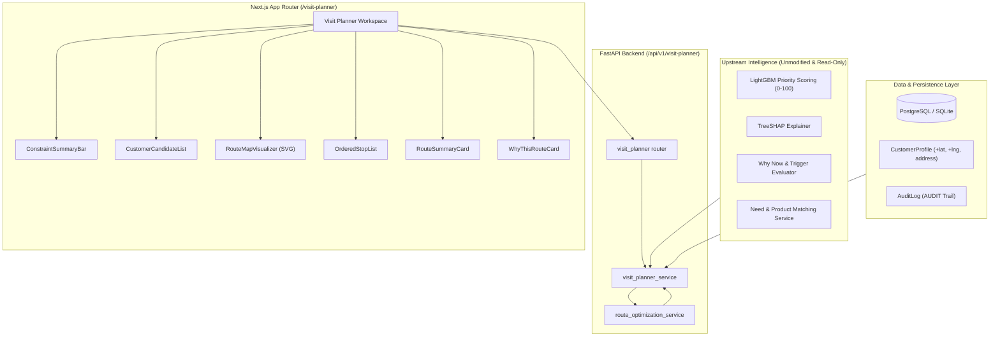

# AI Customer Visit Planner — Technical Report & Architecture

## 1. System Architecture

The **AI Customer Visit Planner** is an enterprise broker decision-support subsystem designed for Krungsri Financial Advisory. It operationalizes existing customer intelligence into a spatially efficient daily customer visit plan.

---

## 2. Route Optimization Approach

The route optimization engine is a high-performance, pure-Python deterministic solver running in **<35ms** with zero external routing dependencies:

1. **Distance & Transit Duration Modeling**:
   - Computes Great-Circle (Haversine) pairwise distances.
   - Applies an empirical **Bangkok Urban Circuity Factor ($1.35\times$)** to account for non-Euclidean road networks, U-turns, and canal bridges.
   - Converts road distance into travel time using calibrated Bangkok urban traffic speeds ($24\text{ km/h}$) with fixed terminal parking padding.
2. **Deterministic Sequence Solver**:
   - Implements a greedy priority-weighted insertion heuristic followed by a **2-Opt local search** algorithm.
   - Objective function optimizes:
     $$\min \sum \text{Transit Time} - \lambda \sum (\text{Priority Score} \times \text{Urgency Weight})$$
   - High-priority and urgent "Why Now" candidates are weighted to be visited earlier along efficient spatial clusters.
3. **Loop Topology**:
   - Enforces a closed-loop tour starting at the broker's designated Krungsri office hub, visiting customers in sequence, and returning to the same office hub before end of working hours.

---

## 3. Hard Constraints

The route solver strictly validates and enforces **Hard Constraints**. If any hard constraint is violated, the route is mathematically classified as **`infeasible`** and actionable deferral recommendations are produced:

1. **Office Hours**:
   - Earliest departure: Default `08:30 น.`
   - Latest return to depot: Default `17:30 น.`
   - Departure cannot precede opening; return must be strictly before or at closing time.
2. **Maximum Daily Travel Time**:
   - Cumulative time spent driving on the road across all legs cannot exceed `150 นาที` ($2.5\text{ hours}$).
3. **Maximum Daily Distance**:
   - Cumulative driving distance cannot exceed `60.0 กม.`.
4. **Start Location**:
   - Must originate from the designated broker office depot (Default: ธนาคารกรุงศรีอยุธยา สำนักพระรามที่ 3, Lat $13.6827$, Lng $100.5478$).
5. **End Location**:
   - Must terminate at the designated broker office depot.

---

## 4. Soft Objectives

Within the boundary of hard constraints, the optimization engine optimizes soft goals:

1. **Customer Priority Maximization**: Visiting the highest-value customers ($Score \ge 70$, High Priority) first.
2. **Why Now Urgency Alignment**: Addressing immediate customer triggers (e.g. motor policy expiring within 21 days, CI policy lapse, mortgage payoff).
3. **Geographic Clustering & Loop Efficiency**: Minimizing circuitous backtracking and zig-zagging between distant Bangkok districts.
4. **Actionable Deferral Transparency**: If a broker selects too many customers causing constraint violation, the engine calculates the marginal time and distance saved for each customer, suggesting who to defer to tomorrow to restore feasibility.

---

## 5. Division of Responsibilities: AI vs Non-AI Optimization

| Component | Responsibility | Methodology |
| :--- | :--- | :--- |
| **AI / ML Layer** | Upstream Customer Intelligence | • LightGBM priority scoring ($0\text{--}100$) • TreeSHAP feature contribution analysis • Rule-based & LLM "Why Now" urgency triggers • Natural language customer briefing & talk tracks |
| **Non-AI Optimization Layer** | Deterministic Route & Constraint Engine | • Haversine geometric matrix calculations • 2-Opt local search combinatorial solver • Hard constraint validation ($100\%$ rule compliance) • Marginal transit savings calculation for deferrals |

---

## 6. Strict Scope Boundary: Customer Appointment Scheduling is OUT OF SCOPE

> [!IMPORTANT]
> **Explicit Architectural Statement**: Customer appointment scheduling is **STRICTLY OUT OF SCOPE** for this feature.
> 
> The system does **NOT** include:
> - Customer appointment windows
> - Specific meeting start/end times
> - Booking or calendar slot reservation
> - Calendar synchronization (Google Calendar / Outlook)
> - Customer rescheduling or RSVP handling
>
> The Visit Planner is exclusively a **broker-side decision support tool** to determine:
> 1. *Who to visit* (based on priority and Why Now)
> 2. *In what order to travel* (geographic loop efficiency)
> 3. *Whether the travel workload is feasible* (daily distance and time caps)

---

## 7. Known Limitations

1. **Urban Speed Approximation**: Travel durations are estimated using a calibrated Bangkok metropolitan velocity model ($24\text{ km/h}$ with $1.35\times$ circuity factor) rather than live Google Maps/HERE probe feeds. Extreme flood or accident delays are not modeled in real time.
2. **Bangkok Metropolitan Focus**: Prototype coordinates and seed distributions are calibrated for Bangkok and perimeter provinces (ยานนาวา, สาทร, บางรัก, วัฒนา, ปทุมวัน, จตุจักร, บางนา).
3. **Static Depots**: Supported start/end points are Krungsri branch hubs (Head Office Rama 3, Ploenchit Tower). Custom start locations (e.g. broker home address) require configuration override.

---

## 8. Measured Performance Benchmarks

Measured on live backend service (`localhost:8000`) over 5 iterations per workload:

| Candidate Count | Total Stops (with Depot) | Average Latency | Min Latency | Max Latency | Feasibility Status |
| :---: | :---: | :---: | :---: | :---: | :---: |
| **3 Customers** | 5 stops | **5.11 ms** | 4.83 ms | 5.49 ms | Feasible |
| **5 Customers** | 7 stops | **5.38 ms** | 5.24 ms | 5.53 ms | Feasible |
| **8 Customers** | 10 stops | **31.53 ms** | 31.22 ms | 32.04 ms | Feasible |
| **12 Customers** | 14 stops | **6.41 ms** | 5.74 ms | 7.31 ms | Infeasible (Limits exceeded, deferrals generated) |

All normal prototype workloads execute in **$<35\text{ ms}$**, satisfying sub-second responsiveness without third-party network dependencies.
